# Table of Contents

[1. Introduction [3](#introduction)](#introduction)

[2. Project Aim [3](#project-aim)](#project-aim)

[3. Theory [4](#theory)](#theory)

[3.1. Heart [4](#heart)](#heart)

[3.1.1. Mechanics of the Heart
[4](#mechanics-of-the-heart)](#mechanics-of-the-heart)

[3.1.2. Cardiac Cycle [5](#cardiac-cycle)](#cardiac-cycle)

[3.1.3. Arrhythmia [7](#arrhythmia)](#arrhythmia)

[3.2. The Doppler-Effect [8](#the-doppler-effect)](#the-doppler-effect)

[3.3. Doppler Radar [10](#doppler-radar)](#doppler-radar)

[3.4. Antenna [14](#antenna)](#antenna)

[4. Prototype Design [16](#prototype-design)](#prototype-design)

[4.1. Universal Radio Software Peripheral (URSP)
[16](#universal-radio-software-peripheral-ursp)](#universal-radio-software-peripheral-ursp)

[4.2. Breadboard Design [16](#breadboard-design)](#breadboard-design)

[4.2.1. Doppler Module [16](#doppler-module)](#doppler-module)

[4.2.2. Filter Stage [16](#filter-stage)](#filter-stage)

[4.2.3. Gain Stage [17](#gain-stage)](#gain-stage)

[4.2.4. Prototype Schematic
[18](#prototype-schematic)](#prototype-schematic)

[4.3. Prototype PCB Design
[19](#prototype-pcb-design)](#prototype-pcb-design)

[5. Final Product Design
[20](#final-product-design)](#final-product-design)

[5.1. Analog-to-Digital Converter (ADC)
[20](#analog-to-digital-converter-adc)](#analog-to-digital-converter-adc)

[5.2. Microcontroller [20](#microcontroller)](#microcontroller)

[5.3. Power Supply [22](#power-supply)](#power-supply)

[5.3.1. Considerations [22](#considerations)](#considerations)

[5.3.2. Battery Options [22](#battery-options)](#battery-options)

[5.4. Finger Sensor [23](#finger-sensor)](#finger-sensor)

[5.5. PCB Design [24](#pcb-design)](#pcb-design)

[6. Algorithm [26](#algorithm)](#algorithm)

[6.1. Development – No Breathing
[27](#development-no-breathing)](#development-no-breathing)

[6.1.1. Oversampling & Averaging
[27](#oversampling-averaging)](#oversampling-averaging)

[6.1.2. Spectrum Analysis [30](#spectrum-analysis)](#spectrum-analysis)

[6.1.3. Matched Filtering [32](#matched-filtering)](#matched-filtering)

[6.1.4. Continuous Wavelet Transform (CWT)
[34](#continuous-wavelet-transform-cwt)](#continuous-wavelet-transform-cwt)

[6.2. Development – Breathing
[45](#development-breathing)](#development-breathing)

[6.2.1. Spectrum Analysis
[45](#spectrum-analysis-1)](#spectrum-analysis-1)

[6.2.2. Continuous Wavelet Transform (CWT)
[47](#continuous-wavelet-transform-cwt-1)](#continuous-wavelet-transform-cwt-1)

[6.2.3. Unwrapped Phase [52](#unwrapped-phase)](#unwrapped-phase)

[6.3. Implementation [53](#implementation)](#implementation)

[6.3.1. Software Structure
[53](#software-structure)](#software-structure)

[6.3.2. Serial Link [54](#serial-link)](#serial-link)

[6.3.3. Data Sampling [54](#data-sampling)](#data-sampling)

[6.3.4. Sample Value Conditioning & Averaging
[56](#sample-value-conditioning-averaging)](#sample-value-conditioning-averaging)

[6.3.5. Sampling Noise [58](#sampling-noise)](#sampling-noise)

[6.3.6. Data Buffering [59](#data-buffering)](#data-buffering)

[6.3.7. Floating Point Calculations
[59](#floating-point-calculations)](#floating-point-calculations)

[6.3.8. Algorithm Outline [61](#algorithm-outline)](#algorithm-outline)

[7. Results [66](#results)](#results)

[8. Conclusion [68](#conclusion)](#conclusion)

[9. Further Work [69](#further-work)](#further-work)

[10. Project Management [70](#project-management)](#project-management)

[Bibliography [72](#_Toc323221586)](#_Toc323221586)

[Appendix A [74](#appendix-a)](#appendix-a)

[Appendix B [79](#appendix-b)](#appendix-b)

# Introduction

Radar has been used for countless applications since its advent. A
particularly useful implementation is one that utilizes the
Doppler-effect, which tells us that there will be a frequency shift
induced in a wave reflected from an object; if that object has motion
relative to the source of the wave. Through measurement of this
frequency shift the velocity of the object can be determined. Today,
radar is utilized mainly for air traffic control, defence and weather
monitoring. Increasingly, however, radar is finding more small scale
applications, such as in the medical and security fields.

In the medical field a lot of attention has been given to Doppler radar
monitoring of vital signs, such as the heart rate. The displacements of
the heart during the cardiac cycle will induce Doppler shifts in the
reflection of a wave transmitted towards it, which if captured and
processed correctly will reveal detail about the functionality of the
heart. The advantage of such a system is that it allows contactless
monitoring to take place; which can, for example, aid those patients who
are expected to stay in hospital for a significant tenure or monitor
those suffering from third degree burns. Furthermore, heart
abnormalities may cause variations in the normal Doppler signature,
which when studied could help determine any functional problems that
exist. In the security field such a system could, for example, be used
to covertly monitor the heart rate of a subject in an airport, where the
aim would be to track the heart rate of a subject to see how they
respond to strenuous questioning, allowing for breaches in security to
be uncovered.

Although this concept has been successfully implemented for the
applications mentioned, the systems are often large and obtrusive.
Therefore, it is desirable to develop a compact unit that can be
discretely hidden or moved around easily. This report follows the
development of such a device, with the intention to provide a
comprehensive basis for future work. It covers two main areas: firstly,
the hardware associated with generating and capturing the Doppler
shifts; and secondly, the software used to process them.

# Project Aim

The main aim of this project was to develop a portable device, utilizing
the Doppler-effect, which could be used to monitor the heartbeat of a
human being. Although this goal remained the same throughout the
project, there was some deviation from the project plan set out in the
project proposal. Originally, it was desirable to be able to use the
portable device to identify functional problems with the heart as well
as establishing the heart rate; however, as the project evolved this
seemed to fall more and more out of scope, due to time constraints.
Taking this into consideration the overall project goal was to develop a
portable device which could accurately determine the heart rate of a
subject through contactless means.

# Theory

## Heart 

The human heart is the most vital organ in the human body. It provides
the brain and muscles with a continuous supply of oxygen, allowing them
to function correctly. It is important to discuss the operation of the
heart as it has influence on the development of the heart rate
monitoring device.

### Mechanics of the Heart

The heart is divided into four chambers, as shown in Figure 1. The
contraction and relaxation of these chambers results in a flow of blood
to the lungs and around the body. They are controlled by the hearts
conduction system, which contains nodal tissues that produce and deliver
electrical impulses. It is these impulses which induce the signal
variations in a traditional Electrocardiogram (ECG), and is known as
automaticity. \[[**1**](#Lar99)\]

<figure>
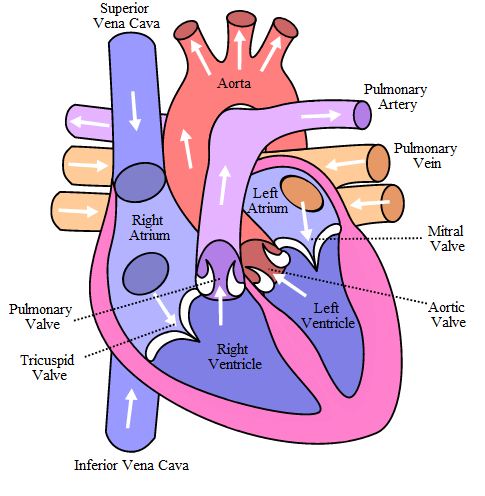
<figcaption><p>Fig The human heart [<a
href="#Var122"><strong>2</strong></a>]</p></figcaption>
</figure>

The de-oxygenated blood from the body enters the right atrium, where it
is pumped through the tricuspid valve into the right ventricle. The
de-oxygenated blood is then pumped through the pulmonary valve and
towards the lungs. When passing through the lungs the blood becomes
oxygenated and then enters the heart again through the left atrium,
where it is pumped through the mitral valve into the left ventricle.
Finally, the oxygenated blood is pumped through the aortic valve into
the aorta where it is then transported around the body. This is shown in
Figure 2.

<figure>
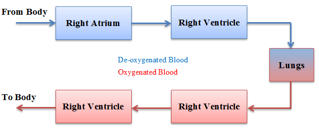
<figcaption><p>Fig The blood flow process</p></figcaption>
</figure>

### Cardiac Cycle

A single heartbeat can be seen as a series of events known as the
cardiac cycle. This cycle is comprised of six phases, as shown in Figure
3.

<figure>
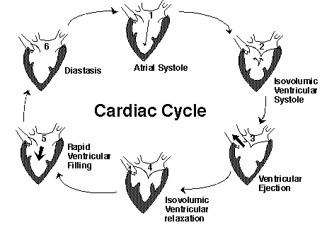
<figcaption><p>Fig Phases of the cardiac cycle</p></figcaption>
</figure>

**Phase 1:** Atrial Systole (Duration = 0.11s)

This is when both the left and right atria contract, causing an increase
in pressure and the flow of blood into the ventricles. Only 20% of the
ventricles volume is filled in this phase. The atrioventricular valves
are shut, preventing backflow as ventricle pressure surpasses that of
the atriums. \[[**3**](#Uni122)\]

**Phase 2:** Ventricular Isometric Contraction (Duration = 0.5s)

The first thing to happen in this stage is the closure of all the heart
valves: aortic, pulmonary and atrioventricular, and results in the first
heart sound (S1). In this period the ventricles contract while the
volume of blood remains constant, causing a rapid increase in
ventricular pressure.

**Phase 3:** Ventricular Ejection (Duration = 0.09s + 0.13s)

This phase is split into two separate events. The first event is the
opening of the semilunar valves (aortic and pulmonary) valves. These
valves open when the pressure in both ventricles exceeds the pressure in
both the aortic and pulmonary arteries. Typically this pressure is
around 120mmHg (16kPa). \[[**4**](#Sil09)\]

The second phase is the decreased ejection period, where the blood flow
decreases. The ventricular pressure becomes lower than that of the
aortic and pulmonary artery pressure, subsequently shutting the
semilunar valves and producing the second heart sound (S2).

**Phase 4:** Isometric Ventricular Diastole (Duration 0.08s)

The ventricles relax and their pressure falls, whereas the atrial
pressure increases due to the atria filling with blood. This causes the
atrioventricular and semilunar valves to close, preventing blood being
pumped into the ventricles.

**Phase 5:** Ventricular Filling (Duration = 0.11s)

As the ventricular pressure drops the atrioventricular valves open and
blood is pumped rapidly into the ventricles, until the heart reaches a
state of diastasis.

**Phase 5:** Diastasis (Duration is dependent on heart rate)

This is the resting period of the heart and can be seen as the first or
last phase of the cardiac cycle. Most of the ventricular blood filling
occurs in this phase (i.e. before atrial systole).

Figure 4 shows a graphical representation of the cardiac cycle. Notice
that the heart sounds are produced when the atrioventricular valves are
either opening or closing.

<figure>
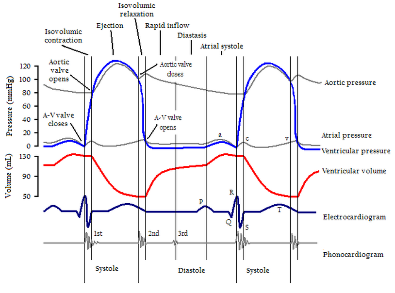
<figcaption><p>Fig Graphical representation of the cardiac
cycle</p></figcaption>
</figure>

### Arrhythmia

Arrhythmia is a type of heart disease which is defined as the
irregularity of the heartbeat. It is a disorder in the contraction and
relaxation patterns of the chambers of the heart. Arrhythmias can be
classified in three ways:

- Tachycardia – heartbeats that are too fast.

- Bradycardia – heartbeats that are too slow.

- Fibrillation – heartbeats that are irregular.

They can also be classed by whether they start in the atria
(supraventricular) or in the ventricles (ventricular), where the latter
is the most serious. \[[**2**](#Var122)\]

Although it is beyond the scope of this project for the device to be
able to identify arrhythmias, the following work is included as a basis
of future work. The next step in the development of this device should
be the development of an algorithm to identify and alert the user of
arrhythmia in the subject’s heart.

The most common type of arrhythmia is atrial fibrillation which causes
the atria to beat in an irregular manner and subsequently reduce the
efficiency of the heart. Figure 5 shows the effect of atrial
fibrillation on an ECG.

\(a\)

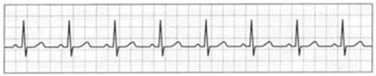

\(b\)

<figure>
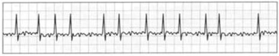
<figcaption><p>Fig (a) ECG of normal heart rhythm (b) ECG of atrial
fibrillation heart rhythm</p></figcaption>
</figure>

The signals in Figure 5 are obtained from an ECG, which works on an
entirely different principle as the technology proposed in this project.
It will therefore be necessary to develop a number of custom heart
signals, based on the expected Doppler shifts, which exhibit different
types of arrhythmias and develop a processing algorithm based on them.
The same will go for any other heart abnormalities the device is
expected to identify.

## The Doppler-Effect

The Doppler-effect has become the fundamental building block of almost
all global radar systems. It is also the fundamental building block of
the portable heart rate monitoring device developed in this project. The
Doppler-effect is the increase (or decrease) in observed frequency of a
reflected wave at a receiver due to the motion of a target towards (or
away from) it. Figure 6 shows a simple illustration of this; notice how
the movement of the heart causes a phase shift in the reflected signal.

<figure>
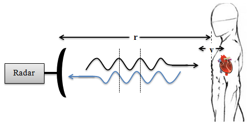
<figcaption><p>Fig The Doppler effect</p></figcaption>
</figure>

In this case $`r`$ represents the distance from the radar antenna to the
heart and $`v`$ represents the relative velocity of the heart during
expansion and contraction. The phase represented by the two-way path
from the radar to the heart is given by Equation 1.

$`\phi = 2\pi\frac{2r}{\lambda}`$ \[Eqn 1\]

The Doppler shift is given by the rate of change of phase, given by
Equation 2. If the heart is contracting (i.e. moving away from the
radar) a phase lag is introduced and the Doppler frequency is negative.
\[[**5**](#Gri12)\]

$`f_{D} = \frac{1}{2\pi}\frac{d\phi}{dt} = \frac{1}{2\pi}\frac{d}{dt}\left( \frac{4\pi r}{\lambda} \right) = \frac{2}{\lambda}\frac{dr}{dt} = \frac{2vf_{0}}{c}`$
\[Eqn 2\]

This theory can be expanded by introducing the micro-Doppler effect.
This effect is caused by the modulation of the base Doppler shift by the
moving parts of the target, resulting in sidebands around the target’s
Doppler frequency. For example, a propeller plane may be moving at a
constant velocity towards a Doppler radar, resulting in a constant
Doppler shift; the propellers on the plane may introduce further Doppler
modulation of the base Doppler shift. This phenomenon is known as the
micro-Doppler effect.

In this application a moving body (the bulk translation) will produce a
base Doppler shift at the receiver and the heart will cause a
micro-Doppler shift. Furthermore, if the body is kept still, then the
heart (the bulk translation) will cause the base Doppler shift and,
quite possibly, movements of the valves and chambers in the heart will
cause micro-Doppler shifts.

From the derivation provided in the project proposal, the micro-Doppler
shift of a vibrating part situated on or within the main target, such as
the heart in a moving body is given by Equation 3.

$`f_{microDoppler} = \frac{2f}{c}\left\lbrack \frac{d}{dt}\mathbf{r}(t) \right\rbrack^{T}.\mathbf{n =}\frac{4\pi ff_{v}D_{v}}{c}\cos\left( 2\pi f_{v}t \right)\mathbf{n}_{v}.\mathbf{n}`$
\[Eqn 3\]

This is a time-varying sinusoidal function, where the part is exhibiting
a vibration characterised by frequency $`f_{v}`$ and maximum
amplitude$`\ D_{v}`$. The unit vector of the vibration direction is
given by Equation 4. \[[**6**](#Che03)\]

$`\mathbf{n}_{v}\mathbf{=}\left\lbrack \cos\alpha_{p}\cos\beta_{p},\sin\alpha_{p}\cos{\beta_{p},\sin\beta_{p}} \right\rbrack^{T}`$
\[Eqn 4\]

As mentioned before the original scope of the project included the
capability of the device to identify particular heart abnormalities as
well as measuring the heart rate. This would most likely be achievable
by ensuring the body is kept still, registering the micro-Doppler shifts
induced by the internal mechanics of the heart and cross referencing
with a healthy heart. However, as the project evolved the scope was
reconsidered, due to the complexity of the original problem, and was
limited to measuring the heart rate only. We can use the induced
frequency shifts to determine the periodic movement of the heart, and
therefore determine the heart rate.

From Equation 2 it is clear to see that using a higher frequency is more
desirable, as it allows for a larger Doppler-shift to be observed. The
reflected wave in this application is reflected from the surface of the
chest and not directly from the heart. Therefore, the Doppler shift is
induced by the displacement of the chest and not the displacement of the
heart. The heartbeat causes a displacement in the chest of around 0.3mm
peak-to-peak. \[[**7**](#Wir03)\]

Some expected results are shown in Table 1.

| Frequency, f | Wavelength, λ (m) | Phase Shift, $`\mathbf{\phi}`$ (deg) |
|:------------:|:-----------------:|:------------------------------------:|
|   2.4 GHz    |       0.125       |                 1.73                 |
|    24 GHz    |      0.0125       |                 17.3                 |
|    40 GHz    |      0.0075       |                 28.8                 |

Expected phase shifts using different frequencies

## Doppler Radar

In order to exploit the Doppler-effect it is necessary to develop a
Doppler radar. Although the actual Doppler module was not designed in
this project, its principles will be described here. There are three
main ways of producing the Doppler-effect and all have their relative
advantages and disadvantages.

The first way is to implement the Doppler radar using the Continuous
Wave (CW) principle. This involves continuously transmitting a high
frequency signal and processing the reflected signal in a continuous
manner. The advantage of such a system is that it is easier to operate
than other Doppler radars. CW Doppler radars suffer from the inability
to determine the range of the target. There can also be high levels
feedback between the transmitter and receiver, leading to degradation in
received signal quality. \[[**8**](#Wol12)\]

An extension of CW Doppler radar can be made by modulating the standard
CW transmitted signal; the amplitude is kept constant, but the signal is
Frequency Modulated (FM). The advantage of using FM is that now the
range of the target can be determined. This is achieved by looking at
the beat frequency which is produced when the echo signal is heterodyned
with part of the transmitted signal. This principle stands for that of a
stationary target; however, a moving target also overlays its own
Doppler shift on the beat frequency. This can lead to incorrect range
deduction and therefore must be corrected through averaging the beat
frequency over multiple cycles of the FM waveform. \[[**9**](#Ser12)\]

Another technique which can be used to overcome the limitation of CW
Doppler radar is pulse-Doppler radar, which can be used to determine
both target velocity and range. Instead of transmitting continuously,
the radar transmits intermittently and determines the range by the time
difference between transmitted and received signals. The relative
velocity of the target is simply determined from the Doppler-shifts
apparent in the pulses. \[[**10**](#Par12)\]

In the case of heart rate monitoring it is not a requirement to be able
to measure the range of the heart from the radar and therefore a simple
CW Doppler-radar can be used. Figure 7 shows an illustration of a CW
Doppler-radar with a single channel.

<figure>
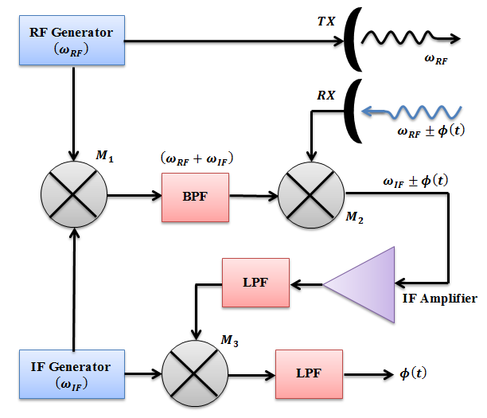
<figcaption><p>Fig Single channel CW Doppler radar</p></figcaption>
</figure>

The first operation of this radar is the mixing of the RF and IF signals
in Mixer 1, which provides a stable Local Oscillator (LO); any unwanted
frequencies are attenuated by the band pass filter. The output of this
mixing stage is given by Equation 5.

$`\cos\left( \omega_{IF}t \right) \times \cos\left( \omega_{RF}t \right) = \frac{\cos\left( \left( \omega_{IF} + \omega_{RF} \right)t \right) + \cos\left( \left( \omega_{IF} - \omega_{RF} \right)t \right)}{2}`$
\[Eqn 5\]

Due to the Doppler-effect, the reflected signal acquires a time varying
phase $`\phi(t)`$ relative to the movement of the heart. As part of the
super-heterodyne topology, the reflected signal is received by RX and
down-converted from RF to IF in Mixer 2. The output of this
down-conversion is given by Equation 6.

$`\left( \frac{\cos\left( \left( \omega_{IF} + \omega_{RF} \right)t \right) + \cos\left( \left( \omega_{IF} - \omega_{RF} \right)t \right)}{2} \right) \times \cos\left( \omega_{RF}t + \phi(t) \right)`$
\[Eqn 6\]

This simplifies to Equation 7.

$`\frac{\cos\left( \omega_{IF}t + \phi(t) \right)}{2} + \frac{\cos\left( \omega_{IF}t + 2\omega_{RF}t + \phi(t) \right)}{4} + \frac{\cos\left( \omega_{IF}t - 2\omega_{RF}t + \phi(t) \right)}{4}`$
\[Eqn 7\]

The reflected signal in the case of heart rate monitoring will be very
weak and therefore the signal must be amplified. Furthermore, we are
only interested in the low frequency term and consequently the signal is
passed through a low pass filter before finally being demodulated in
Mixer 3. The output of Mixer 3 is given by Equation 8.

$`\left( \frac{\cos\left( \omega_{IF}t + \phi(t) \right)}{2} \right) \times \cos\left( \omega_{IF}t \right) = \frac{\cos\left( 2\omega_{IF}t + \phi(t) \right)}{4} + \frac{\cos\left( \phi(t) \right)}{4}`$
\[Eqn 8\]

This leaves a term which is dependent only on the phase shift of the
signal and can be isolated by passing the signal through a low pass
filter stage. This signal is the Doppler-shift introduced by the
movement of the heart and can be used to calculate the heart rate.

A typical resting heart rate ranges between 60-100 beats per minute, but
can be as low as 30 beats per minute and as high as 180 beats per
minute. A typical respiration rate ranges between 12-20 breaths per
minute, but can go up to 80 breathes per minute during heavy exercise.
The actual Doppler information acquired by the reflected signal is of
little interest to us in this application; however, the periodicity of
the Doppler variations is.

Since both the respirational and cardiac cycles will induce Doppler
shifts in the reflected signal its frequency spectrum will contain two
peaks, relating to the periodicity of the Doppler shifts. For a
respiration rate of 15 breaths per minute and heart rate of 70 beats per
minute, the frequency spectrum will exhibit peaks at 0.25 Hz and 1.17 Hz
respectively. This is shown in Figure 8. \[[**11**](#Uni12)\]

<figure>
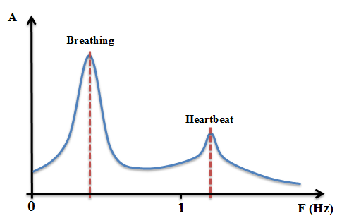
<figcaption><p>Fig Expected frequency spectrum of reflected
signal</p></figcaption>
</figure>

From the maximum range of heart rates described above it is likely that
the heartbeat peak will fall within the range of 0.5 Hz – 3 Hz. It is
therefore appropriate to isolate this band of frequencies using a
bandpass filter. Under periods of intense activity the respiration rate
may be high enough for its peak to move into this frequency band,
otherwise under normal conditions it will be under the lower frequency
cut-off.

The heart has two main movements when operating: the first movement
occurs when the heart is filling with blood and is called diastole; the
second movement occurs when the heart contracts and is known as systole.
Although it is beyond the scope of this project for the device to be
able to identify abnormalities of the heart, it is important to provide
a basis for future work.

If there was a discrepancy in the heart operation, it would be important
for the user to be able to determine whether this discrepancy is
occurring during diastole or systole. This can be achieved by
introducing quadrature demodulation to the CW Doppler radar allowing for
the sign of the Doppler frequency to be determined.
\[[**12**](#Uni121)\]

Figure 9 shows how a quadrature demodulator is implemented.

<figure>
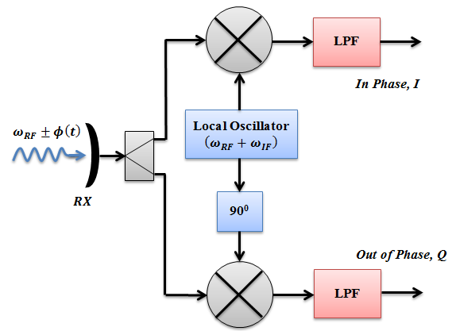
<figcaption><p>Fig Quadrature demodulator</p></figcaption>
</figure>

Equations 9 & 10 now apply. If the heart is in systole (i.e. moving away
from the radar) the Doppler frequency is negative, and if the heart is
in diastole the Doppler frequency is positive. This would be useful when
the user is trying to determine where and when abnormalities are
occurring. \[[**13**](#Par)\]

$`\phi = \tan^{- 1}\left( \frac{Q}{I} \right)`$ \[Eqn 9\]

$`f_{D} = \frac{1}{2\pi}\frac{d\phi}{dt}`$ \[Eqn 10\]

## Antenna

The accuracy of a Doppler radar system can be dramatically improved
through careful antenna design. It is important to discuss the relevant
issues associated with choosing and designing an antenna for this
application. The main design decisions in this application are related
to the frequency of operation and the desired compactness of the
portable device.

Inherently, high frequency antennas are smaller in size than lower
frequency ones and they are generally easier to design and manufacture.
The only drawback is in the radar module itself, which becomes more
complex and more expensive to implement as the operating frequency
increases.

Realistically, there are two options available for this application. The
first option is to use a planar antenna and the second option is to use
some type of waveguide antenna, such as a horn antenna. The benefit of
using a planar antenna is that it is significantly more compact than a
horn antenna, although its maximum gain is limited.

Using Equations 11 & 12, the typical dimensions of a 24 GHz single patch
antenna can be calculated. \[[**14**](#Ton121)\]

$`k_{nm}^{2} = \left( \frac{n\pi}{L} \right)^{2} + \left( \frac{m\pi}{W} \right)^{2}`$
\[Eqn 11\]

$`f_{nm} = \frac{k_{nm}c}{2\pi\sqrt{\varepsilon_{r}}}`$ \[Eqn 12\]

Where *m* and *n* determine the magnetic surface current mode
and$`\ \varepsilon_{r}`$ is the relative permittivity of the dielectric
medium the patch is mounted on (FR-4 ≈ 4.3 F/m). For the fundamental
mode of operation TM<sub>10</sub> we get Equation 13:

$`L = \frac{c}{2f_{10}\sqrt{\varepsilon_{r}}}`$ \[Eqn 13\]

This yields a resonant length of L ≈ 3 mm, which is very small relative
to the size of the portable device. The directivity achieved by a single
patch of this size is around 7 dBi. The directivity of the patch can be
used to estimate the link budget between the radar module and the
target. The link budget is governed by the radar equation, given by
Equation 14. \[[**15**](#Uni123)\]

$`P_{r} = \frac{P_{t}G_{t}G_{r}\lambda^{2}\sigma}{(4\pi)^{2}r^{4}}`$
\[Eqn 14\]

In this case G<sub>t</sub> = G<sub>r</sub> as the same antenna is used
for both transmitting and receiving. The Radar Cross Section (RCS) of
human cardio-respiratory motion when in the supine position is 0.326
m<sup>2</sup>. In the prone position this increases to 2.9
m<sup>2</sup>. If the distance *r* between the antenna and the chest is
held at 0.5m and the transmitted power *P<sub>t</sub>* is 10 dBm, then
the power received by the radar for a subject in the supine position is
-28.9 dBm. \[[**16**](#Kir09)\]

Realistically, the subject will be in the sitting position when being
monitored. This will act to lower the RCS of the cardio-respiratory
motion and subsequently lower the received power. By increasing the
number of patches on the antenna its gain can be significantly improved,
increasing the power received by the radar and improving signal clarity.
At 24 GHz a five element array can provide a gain of 12 dBi, which will
increase the power received by the radar to -18.8 dBm.
\[[**17**](#LuD)\]

Horn antennas are generally large structures that work by transforming
guided waves into radiated waves through the use of a flared horn. They
normally have broadband characteristics and the opening of the horn may
be regarded as a true aperture, for analysis by aperture theory. The
typical dimensions of a horn antenna operating at 24GHz are as follows:
Height = 38 mm; Width = 48 mm; Length = 48 mm. A typical gain achieved
by an antenna of this size operating at this frequency is 17 dBi, which
would increase the power received at the radar to -2.9 dBm.
\[[**18**](#Mic121)\]

Table 2 shows the various received power levels for different antenna
types for both supine and prone positions.

<table style="width:76%;">
<caption><p>Expected received power levels for different
antennas</p></caption>
<colgroup>
<col style="width: 20%" />
<col style="width: 26%" />
<col style="width: 14%" />
<col style="width: 14%" />
</colgroup>
<thead>
<tr>
<th rowspan="2" style="text-align: center;">Antenna Type</th>
<th rowspan="2" style="text-align: center;">Gain (dBi)</th>
<th colspan="2" style="text-align: center;">Received Power (dBm)</th>
</tr>
<tr>
<th style="text-align: center;">Supine</th>
<th style="text-align: center;">Prone</th>
</tr>
</thead>
<tbody>
<tr>
<td style="text-align: center;">Single Patch</td>
<td style="text-align: center;">7</td>
<td style="text-align: center;">-28.9</td>
<td style="text-align: center;">-13.4</td>
</tr>
<tr>
<td style="text-align: center;">Planar Array</td>
<td style="text-align: center;">12</td>
<td style="text-align: center;">-18.8</td>
<td style="text-align: center;">-9.4</td>
</tr>
<tr>
<td style="text-align: center;">Horn Antenna</td>
<td style="text-align: center;">17</td>
<td style="text-align: center;">-2.9</td>
<td style="text-align: center;">0.62</td>
</tr>
</tbody>
</table>

# Prototype Design

## Universal Radio Software Peripheral (URSP)

It was first thought that the proposed ‘Heart Rate Monitor’ device could
be prototyped using the URSP N210 devices. These devices interface with
LABVIEW, where signal processing techniques can be used to extract
useful information. However, after extensive testing it became apparent
that the URSP devices were unsuitable for this application for a number
of reasons. The first reason was that the 2.4 GHz operating frequency
was far too low to obtain a reasonable Doppler shift from the heart.
Secondly, the useful part of the signal was indistinguishable from the
high levels of noise. Finally, the processing power of the computer fell
short of the device requirements, introducing latency and inaccuracy to
the results.

## Breadboard Design

### Doppler Module

The main reason for using the URSP devices in the first place was to
utilize their built in CW Doppler radar systems. As mentioned the
operating frequency was too low for this application. It therefore
became desirable to either find or build a higher frequency Doppler
radar module. It was decided that the K-band Quadrature Doppler module
NJR4261J would be used for the remainder of this project. This decision
was based on the fact that the module had proved successful in similar
applications and had a desirable operating frequency.

Its main operational characteristics are as follows:

- Operation frequency: 24 GHz.

- Antenna: Patch antenna (10 dBi), WR-42 Horn antenna (17 dBi).

- I & Q baseband outputs.

- Compact size ($`44\ mm \times 22\ mm \times 9\ mm`$).

- Power consumption: 50 mA at 5 V supply.

- Output power: 8.2 dBm (typical).

The breadboard prototype consisted of the Doppler module, a filter stage
and a gain stage.

### Filter Stage

The low-pass filter has a cut-off frequency of 23 Hz and is required to
filter out interfering signals, such as mains noise. It is implemented
as an active Sallen-Key second order filter. The advantage of this
2-pole filter is that the frequency response is a lot sharper, obtaining
a 40dB/decade roll-off.

The Sallen-Key filter topology is shown in Figure 10.

<figure>
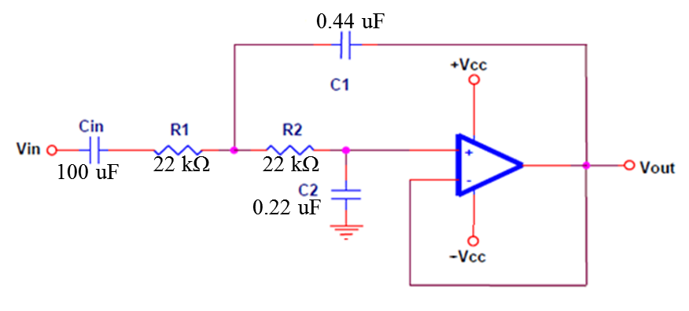
<figcaption><p>Fig Dual-supply Sallen-Key low-pass filter
topology</p></figcaption>
</figure>

The cut-off frequency of this filter is given by Equation 15.
\[[**19**](#Var123)\]

$`f_{o} = \frac{1}{2\pi\sqrt{R_{1}R_{2}C_{1}C_{2}}}`$ \[Eqn 15\]

### Gain Stage

The output voltage of the I & Q channels, due to typical subject
movements, was around 20mV peak-to-peak and it was therefore necessary
to implement a gain stage. The gain stage is implemented using a simple
inverting op-amp topology, shown in Figure 11, and follows the filtering
stage.

<figure>
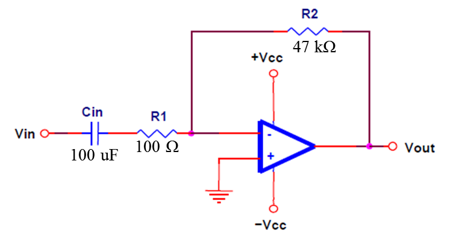
<figcaption><p>Fig Inverting op-amp topology</p></figcaption>
</figure>

The gain in this case was 470 and was set using Equation 16.
\[[**20**](#Car00)\]

$`G = \frac{V_{out}}{V_{in}} = - \frac{R_{2}}{R_{1}}`$ \[Eqn 16\]

### Prototype Schematic

The analogue-to-digital conversion (ADC) was performed by a NI-DAQ; a
USB peripheral with 12 bit resolution and up to 5 kHz sampling rate. The
circuit was supplied by a dual-rail supply of ±9 V in order to make use
of the dynamic range of the DAQ. The Doppler module voltage was limited
to 5 V and therefore a voltage regulator was used to step down the
supply. The I & Q channels had identical but separate filtering and
amplification circuitry and were sampled by the DAQ. The prototype
schematic is shown in Figure 12.

<figure>
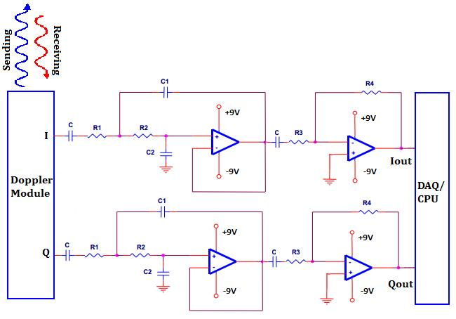
<figcaption><p>Fig Prototype circuit design</p></figcaption>
</figure>

The component values used in the prototype are shown in Table 3.

|          Component           |  Value  |
|:----------------------------:|:-------:|
|              C               | 100 μF  |
| R<sub>1</sub>, R<sub>2</sub> |  22 kΩ  |
|        C<sub>1</sub>         | 0.44 μF |
|        C<sub>2</sub>         | 0.22 μF |
|        R<sub>3</sub>         |  100 Ω  |
|        R<sub>4</sub>         |  47 kΩ  |

Component values used in prototype

## Prototype PCB Design

The prototype that was built in Section 4.2 was tested and the initial
results were promising. The Doppler shifts associated with the
respirational and cardiac cycles were clearly distinguishable in the
signal. As a crucial part of this project was to develop an algorithm
which could determine the heart rate of the subject, it became desirable
to design a more robust and compact circuit which could be used for
extensive testing. This was best achieved through the development of a
Printed Circuit Board (PCB). In addition, the PCB made it easier to spot
design faults and also prevent parasitic capacitance altering the
electronic characteristics of the circuit.

The first PCB designed in this project was based on the prototype
developed in Section 4.2 and is shown in Figure A1 and Figure A2
(Appendix A).

The regulator LM7805 used in the PCB to supply the Doppler module with 5
V from the raw 9 V supply has the following operational characteristics:

- Dropout voltage (required headroom): 2 V

- Power Dissipation: (9V - 5V) × 50 mA = 0.15 W

In Figure A1, C<sub>10</sub> and C<sub>14</sub> are electrolytic
decoupling capacitors, which not only improve the transient time
response but also aid in noise rejection. In addition, they decouple the
circuit from the power supply and act to stabilize the regulator
internal loop. The filter and gain stages of the circuit were
implemented using a quad op-amp and ADC was carried out by the NI-DAQ.

# Final Product Design

The overall objective of this project was to develop a portable heart
rate monitoring device. The prototype PCB designed in Section 4.3 was
used extensively for testing and development; however, for it to become
stand-alone additional functionality was required. It was therefore
necessary to redesign the device. Again, the K-band Quadrature Doppler
module NJR4261J was used as the CW radar system. The additional
functionality consisted of on-board ADC, a power supply, an infra-red
reference finger sensor, a microcontroller and an embedded display.

## Analog-to-Digital Converter (ADC)

Through observation of the results obtained from the PCB design, it was
decided that more resolution was required in the sampled signal. The ADC
solution also had to be embedded on the final PCB design. After an
extensive product search, the ADS1147 from Texas Instruments was decided
on.

The ADS1147 has the following operational characteristics:

- 16 bit resolution with no missing codes, 4 inputs.

- Up to 2 kHz sampling rate for a single channel. To maintain 16 bit
  effective resolution, the sampling rate should not exceed 320 samples
  per second (SPS).

- Fast settling time when changing input channel. Multiple channels can
  therefore be sampled without significant overhead.

- Relatively low cost and low power consumption.

A minimum of two channels are required to sample I & Q channels. The
reference IR finger sensor does not require such high resolution and can
therefore be sampled by the microcontroller’s built-in ADC. The input
voltage range of this ADC is 5V, which sets the limit on the maximum
signal swing. The analogue processing could still be carried out on
higher-voltage rails (±9V), but this would have to be divided down to a
final range of 5V.

## Microcontroller

The embedded microcontroller used to process the signal had to meet a
number of stringent processing power and memory requirements. It must be
able to hold all the sampled data in RAM memory and have enough flash
memory to store the code required for the algorithm implementation.

After an extensive product search, a microcontroller based on the ARM
Cortex-M3 architecture was selected. This particular microcontroller is
called the LPC1769, shown in Figure 13, and is manufactured by NXP. The
reasons for choosing this particular part were its processing power and
the availability of a very low-cost development board.

The microcontroller was shipped on a PCB that consisted of two parts:
the programmer and the microcontroller part.

<figure>
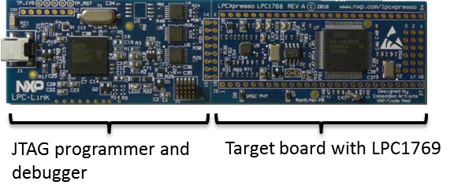
<figcaption><p>Fig LPC1769 microcontroller and development
board</p></figcaption>
</figure>

The LPC1769 has the following operational characteristics:

- 64 kbytes of flash program memory.

- 32 kbytes of RAM memory.

- Up to 120 MHz operation, one instruction per clock.

- Power efficient: 30 mA current consumption at 40 MHz.

- Built-in 12 bit ADC with up to 200 kSPS sampling rate.

- Full debugging support.

- Extensive software library, free development tools.

During the development process the two boards were left joined together.
Once the code was ready and ported to the microcontroller the boards
were separated. A pin connector was attached so that the target board
can be re-programmed.

Compared to simple AVR and PIC microcontrollers, ARM Cortex has much
more complex clocking, interrupt and execution error handling. The
software has to initialise the part correctly, otherwise it will not
run, or run at the wrong frequency. Fortunately, a software library
called Cortex Microcontroller Software Interface Standard (CMSIS) is
provided for free, and introduces a way of accessing special features of
the microcontroller with the standard C-language syntax.

Also, a DSP library is provided for this family of microcontrollers,
including functions for all the common digital signal processing tasks
such as:

- Basic real and complex number arithmetic.

- Complex FFT transforms.

- Convolution.

- Trigonometry functions.

- FIR and IIR filters.

- Matrix operation functions.

All these functions are available for both floating-point and
fixed-point formats.

## Power Supply

### Considerations

For the circuit to be portable, it must be powered from a battery. The
battery must satisfy the current requirements, shown in Table 4, for a
desired operational period.

<table>
<caption><p>Power consumption of portable device</p></caption>
<colgroup>
<col style="width: 23%" />
<col style="width: 24%" />
<col style="width: 23%" />
<col style="width: 28%" />
</colgroup>
<thead>
<tr>
<th style="text-align: center;">Component</th>
<th style="text-align: center;">Maximum Current Consumption (mA)</th>
<th style="text-align: center;">Essential Current Consumption (mA)</th>
<th style="text-align: center;">Regulator Number</th>
</tr>
</thead>
<tbody>
<tr>
<td style="text-align: center;">Doppler Module</td>
<td style="text-align: center;">50</td>
<td style="text-align: center;">50</td>
<td>1 – Dedicated Regulator</td>
</tr>
<tr>
<td style="text-align: center;">LCD Display</td>
<td style="text-align: center;">1.3</td>
<td style="text-align: center;">1.3</td>
<td rowspan="3">2 – Main Vcc</td>
</tr>
<tr>
<td style="text-align: center;">LCD Backlight</td>
<td style="text-align: center;">70</td>
<td style="text-align: center;">-</td>
</tr>
<tr>
<td style="text-align: center;">ADS1147 (ADC)</td>
<td style="text-align: center;">0.25</td>
<td style="text-align: center;">0.25</td>
</tr>
<tr>
<td style="text-align: center;">LPC1769 (μC)</td>
<td style="text-align: center;">30</td>
<td style="text-align: center;">30</td>
<td>3 – 3.3 Volts</td>
</tr>
<tr>
<td style="text-align: center;">Finger Sensor LED</td>
<td style="text-align: center;">100</td>
<td style="text-align: center;">-</td>
<td>Directly from Battery</td>
</tr>
<tr>
<td style="text-align: center;"><strong>Total</strong></td>
<td style="text-align: center;"><strong>250</strong></td>
<td style="text-align: center;"><strong>80</strong></td>
<td></td>
</tr>
</tbody>
</table>

The maximum current of 250mA that is expected to be drawn by the device
is too high for the batteries to provide a sustainable supply and
achieve their nominal capacity. However, when the LCD backlight and IR
finger are not in use the current consumption is brought down to 80mA.
Furthermore, the voltage regulators introduce a level of inefficiency to
the device. From the datasheet of the switching boost converter MCP1623,
its maximum output current for an input voltage of 2.2 V (1.1 V for each
battery cell when drained) is around 115 mA. It can also be noted that
both the LCD backlight and IR finger sensor LED can be powered directly
from the battery, by-passing any voltage regulators and improving
efficiency.

Another way to minimise power consumption is by putting the
microcontroller in sleep mode. Continuous sampling operations occupy
very little processor time, and the algorithm calculations take around
150ms per one-second cycle. The power consumption in sleep mode is
almost negligible in context of this application and it would therefore
be possible to reduce microcontroller power consumption by a factor of
5.

Power supply design is important for this device as ADC requires a clean
stable power supply. The DC-DC boost converters produce a lot of
switching noise (ripple). To smooth it effectively, Low Drop-Out (LDO)
regulators with a high Power Supply Rejection Ratio (PSRR) are used
after the DC-DC converter to smooth the supply voltage.

### Battery Options

The following is a list of battery types that can be used to power the
portable device:

- Lithium: capacities of around 1000-1500 mAh, voltage ≈ 3.7 volts.

- Alkaline: each cell gives 1.5V, around 2200 mAh capacity.

  - Actual capacity is less if discharged at high current.

- Rechargeable AA/AAA: each cell gives ≈ 1.2V, less as its being
  discharged.

- 9V Cell: consists of 6 individual cells, quite low capacity of around
  500 mAh.

Both single-supply and dual-supply power configurations were considered
for the portable device. The advantage of using a dual-supply (±V) is
that it gives a greater voltage swing and most op-amps are optimised for
dual-supply. However, it is more difficult to generate a dual-supply
from a battery as additional components are required, such as a voltage
inverter, to generate the negative voltage, and a negative voltage
regulator.

After considering the options outlined above, it was decided a
single-supply alkaline power supply would be used. The power supply
arrangement is shown in Figure 14.

<figure>
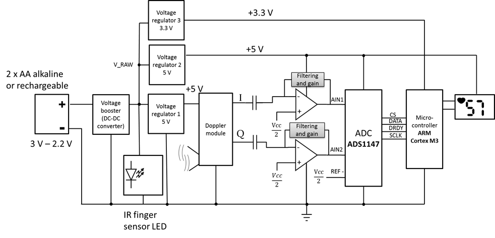
<figcaption><p>Fig Power supply arrangement</p></figcaption>
</figure>

Through previous tests, the Doppler module was revealed to be very
sensitive to power supply ripple and it therefore has its own dedicated
voltage regulator.

The only advantage of using a dual-supply in this case would be a larger
signal swing, which could lead to a greater SNR. However, the noise
embedded in the output of the Doppler module is a lot higher than the
floor noise of the system, and gets amplified together with the signal.
Therefore the signal and the noise get amplified equally and a higher
supply voltage will not necessarily result in a greater SNR. The raw
output voltage V_RAW can be adjusted to ≈ 5.5V to give the LDOs enough
headroom.

## Finger Sensor

In order to test the accuracy of the device an infra-red finger sensor
was built into the final product design. Unlike the Doppler radar, the
finger sensor requires contact between the subject and the device.

The finger heart beat sensor works by shining infra-red light into body
tissue that is rich in blood vessels. Depending on the oxygenation level
in the blood, different amounts of IR light are reflected and absorbed.
Since changes in oxygenation are synchronous with the cardiac cycle, it
is possible to detect the heart beat by tracking variations in the
reflected IR light.

The circuit schematic of the finger sensor is shown in Figure 15. The
infra-red LED and sensor diode are placed next to each other and tilted
towards each other. The tip of the finger is placed on top of them, as
shown in Figure 16.

<figure>
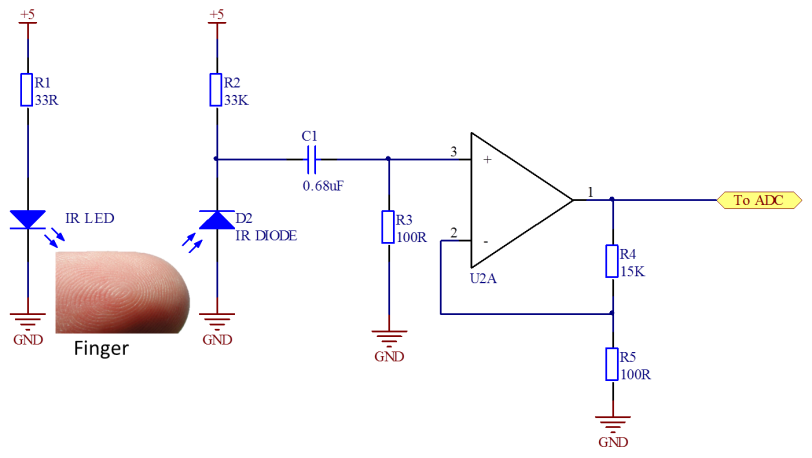
<figcaption><p>Fig IR finger sensor circuit schematic</p></figcaption>
</figure>

<figure>
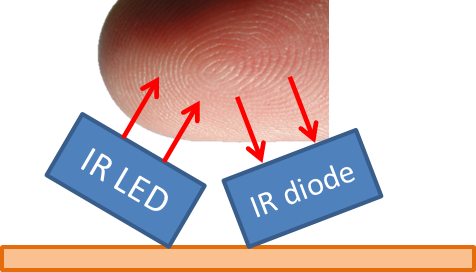
<figcaption><p>Fig Finger sensor operation</p></figcaption>
</figure>

## PCB Design

Similarly to the prototype design it was desirable to design a PCB for
the final product as well. It was decided, for compactness and
durability, that surface mount technology would be used. In addition to
the extra functionality that was added, some alterations were made to
the original prototype design. In the original prototype design there
was a single gain stage of 470. In the final product design this was
increased to 1000 and was split into two stages, which allowed for
better noise rejection and stability.

The two stage gain topology is shown in Figure 17.

<figure>
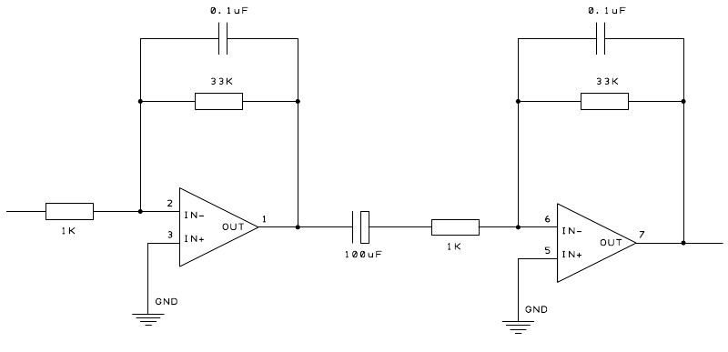
<figcaption><p>Fig Two stage gain topology</p></figcaption>
</figure>

In this case both stages had a gain of 33, giving an approximate overall
gain of 1000. Although it was intended that this change was made before
the fabrication of the PCB, it was not and because of the limited space
on the final PCB it was difficult to simply add an extra gain stage.
Instead, the required gain was implemented by setting the gain of the
first stage to 37 and the setting internal gain of the ADS1147 to 32.
With this approach there is minimal interference with the PCB, but at
the cost of losing a pole in the low-pass filter.

The final PCB circuit schematic is shown in Figure A3 and the
corresponding layout is shown in Figure A4. Included in Appendix A is a
brief guide to the pin-outs of the final PCB and details on the
connections between the PCB and microcontroller. This is intended for
debugging purposes and is shown in Table A1.

# Algorithm

A significant part of this project consisted of establishing a robust
algorithm which would take the raw signal data, obtained from Data
Acquisition (DAQ), process it and display a meaningful result. The
result in this case is the heart rate. A number of Digital Signal
Processing (DSP) techniques have been tried and the following sections
will outline the development of this algorithm. Figure 18 & 19 show the
raw signal data without breathing and with breathing respectively,
although both signals have been subjected to oversampling and averaging
which is discussed in the next section.

<figure>
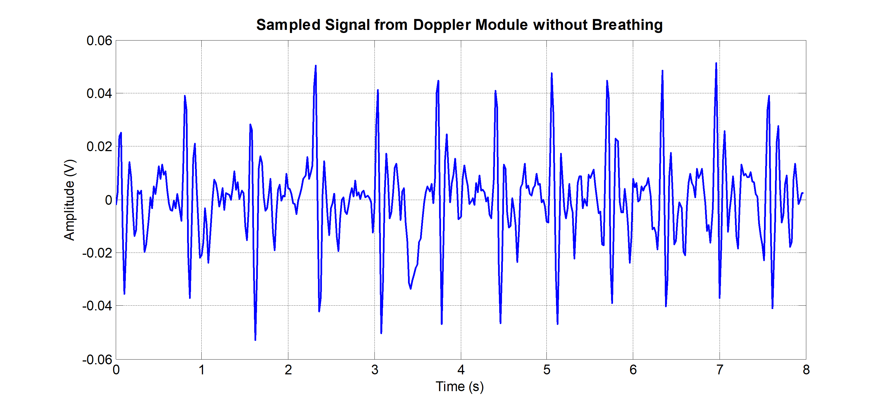
<figcaption><p>Fig Raw signal data without breathing</p></figcaption>
</figure>

<figure>
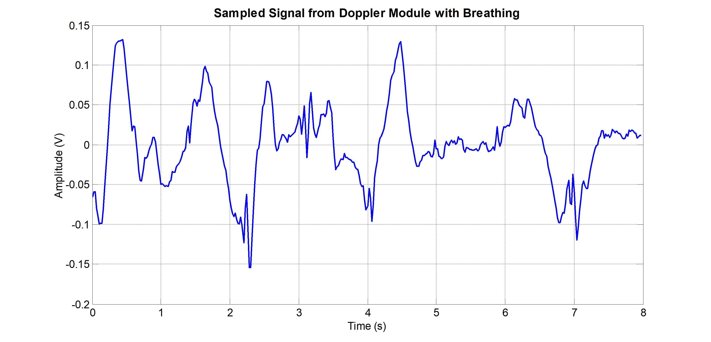
<figcaption><p>Fig Raw signal data with breathing</p></figcaption>
</figure>

It is clear to see the periodicity of the signal introduced by the
heartbeat in Figure 18. In Figure 19 however, the noise introduced by
breathing is much larger than that of the heartbeat and therefore a more
complex signal processing problem is presented. An initial algorithm was
established by concentrating primarily on the raw signal data without
breathing.

There are two stages to the development of this algorithm. The first
stage concentrates on its development in MATLAB and the second stage
consists of the implementation of the algorithm on the microcontroller.

## Development – No Breathing

### Oversampling & Averaging 

Oversampling & Averaging is a common technique used to enhance ADC
resolution. As the signal from the Doppler module is inherently noisy,
resolving a series of bits into a signal bit can improve its resolution
and eliminate its random noise.

This technique requires a higher number of samples, which is achieved by
oversampling the signal. Equation 17 gives the oversampling frequency:
\[[**19**](#ATM05)\]

$`\mathbf{f}_{\mathbf{oversamping}}\mathbf{=}\mathbf{4}^{\mathbf{n}}\mathbf{\times}\mathbf{f}_{\mathbf{nyquist}}`$
\[Eqn 17\]

Where $`n`$ is the required number of additional resolution bits. There
are a number of criteria which must be met for effective oversampling.

- The signal component of interest should not vary significantly during
  a conversion.

- There should be some noise present in the signal (small variations).

- The amplitude of the noise should be at least 1 Least Significant Bit
  (LSB).

After the samples have been acquired averaging occurs. However, this is
not averaging in a conventional sense, where all *m* samples are added
and then dived by *m*. Instead a moving average is implemented, where
*m* readings are placed in a group and then an average of this group is
taken. Figure 20 shows a series of moving averages on a set of data.

<figure>
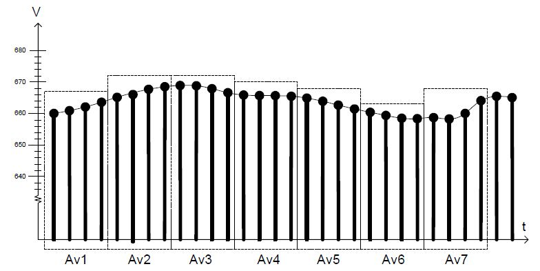
<figcaption><p>Fig The moving average principle</p></figcaption>
</figure>

If this principle is applied to the raw signal data then a significant
improvement can be made to its resolution. Figure 21 shows a heartbeat
signal, sampled at 50 Hz for a period of 10 seconds, without the
implementation of this technique.

<figure>
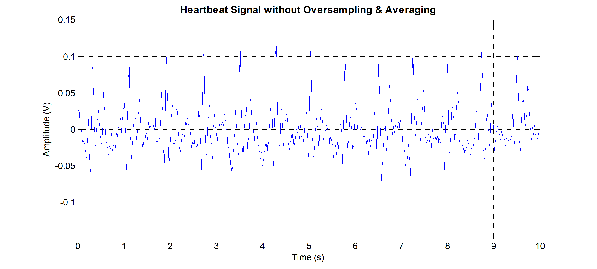
<figcaption><p>Fig Heartbeat signal without Oversampling &amp;
Averaging</p></figcaption>
</figure>

Figure 22 shows a heartbeat signal sampled at 3000 Hz, where the
averaging factor *m* is 60. This produces a pseudo sampled digital
signal at 50 Hz. It is clear to see the improved resolution.

<figure>
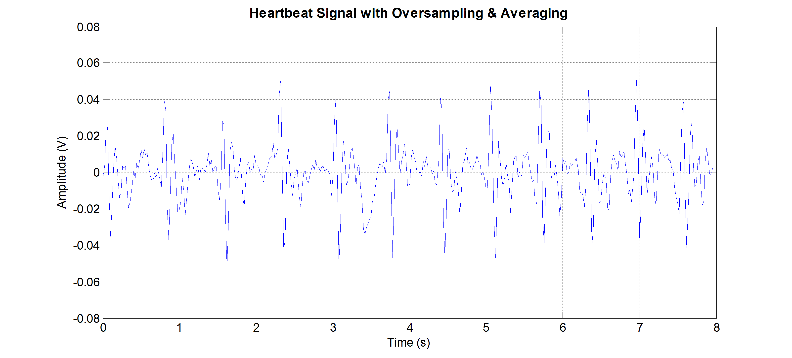
<figcaption><p>Fig Heartbeat signal with Oversampling &amp;
Averaging</p></figcaption>
</figure>

Oversampling & Averaging can be implemented in MATLAB by creating a
vector of zeros, *m* times smaller than the number of samples taken
during the oversampling period, and then averaging each group of *m*
samples and assigning to a non-arbitrary index in this vector.

The following MATLAB script carries out this operation:

``` matlab
TIME = 10; % Sampling period
SAMPLING_RATE = 3000;
M = 60; % Averaging factor
% DAQ function
[data,time] = DAQ_signal_in(TIME,10,SAMPLING_RATE,M);
% Extraction of in-phase and quadrature components
N = TIME*SAMPLING_RATE;
data_I = data(1:N,1);
data_Q = data(1:N,2);
% Creation of zero vectors
average_I = zeros(N/M,1);
average_Q = zeros(N/M,1);
% for loop which averages and assigns samples to a vector index
for k=1:((N/M)-1)
index=k*M;
average_I(k)=sum(data_I(index:index+M))/M;
average_Q(k)=sum(data_Q(index:index+M))/M;
end
% Re-assigning the data vectors
data_I = average_I;
data_Q = average_Q;
% Sizing the vectors to avoid drop-off
data_I = data_I(1:end-(2*SAMPLING_RATE/M));
data_Q = data_Q(1:end-(2*SAMPLING_RATE/M));
data_I(end) = data_I(end-1);
data_Q(end) = data_Q(end-1);
% Mean removal
data_I = data_I-mean(data_I);
data_Q = data_Q-mean(data_Q);
% Ensures time vector is the same length as new data vectors
time = time(1:max(size(data_I)));
```

### Spectrum Analysis

As the signal demonstrates periodic activity, the Fourier Transform can
be used to try and identify the frequency of this periodic activity. The
spectrum of the recorded signals can be calculated directly using the
Fast Fourier Transform (FFT). Figure 23 shows the I-Channel and its
respective frequency spectrum.

<figure>
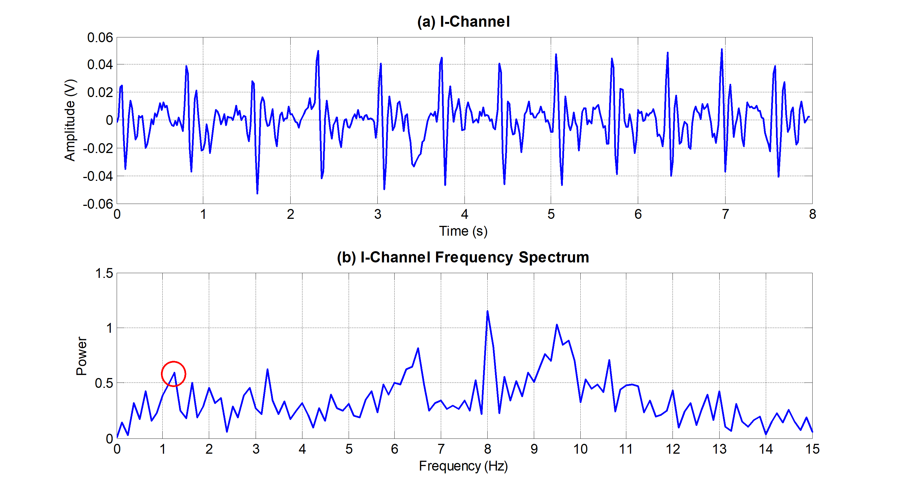
<figcaption><p>Fig 23 (a) I-Channel Signal (b) I-Channel Frequency
Spectrum</p></figcaption>
</figure>

The I-Channel signal in Figure 23(a) was taken from a subject at rest.
Average resting heart rates fall between 60 and 100 beats per minute,
and this will correspond to a peak in the frequency spectrum between 1
Hz and 1.7 Hz. In this range the most prominent peak falls at 1.25 Hz,
corresponding to a heart rate of 75 beats per minute.
\[[**20**](#Las12)\]

It is prudent to apply the same theory to the Q-Channel. Figure 24 shows
the Q-Channel and its respective frequency spectrum. Again, the
prominent peak in the 1 to 1.7 Hz range is expected.

<figure>
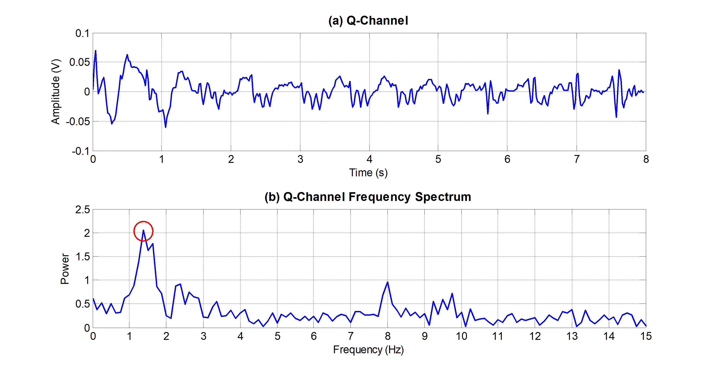
<figcaption><p>Fig (a) Q-Channel Signal (b) Q-Channel Frequency
Spectrum</p></figcaption>
</figure>

In Figure 24(b) the prominent peak falls at 1.375Hz, corresponding to a
heart rate of 83 beats per minute. There is obviously some discrepancy
between these results, indicating that this method may not be as robust
as necessary. One could argue this discrepancy could be avoided by using
just one of the channels; however, there is no certainty as to which
channel will provide the most accurate result.

This method is implemented in MATLAB using the following code:

``` matlab
% The frequency range and resolution is calculated
dF = (SAMPLING_RATE/M)/max(size(time));
f = 0:dF:SAMPLING_RATE/M-dF;
f = transpose(f);
f = f(1:size(f)/2);
% The I-Channel spectrum is calculated
spectrumI = (abs(fft(data_I)));
spectrumI = spectrumI(1:size(spectrum)/2);
% The Q-Channel spectrum is calculated
spectrumQ = (abs(fft(data_Q)));
spectrumQ = spectrumQ(1:size(spectrum)/2);
```

### Matched Filtering

Matched filtering is an effective tool in augmenting the presence of a
known signal pattern. The matched filter is the optimal linear filter
for maximising the Signal-to-Noise Ratio (SNR) of a signal. To implement
a matched filter, a template much first be established; in this case the
template is the signal variation that is introduced by the heartbeat.
Figure 25 shows the heartbeat template, which will be referred to as the
heartbeat kernel. \[[**21**](#Var12)\]

<figure>
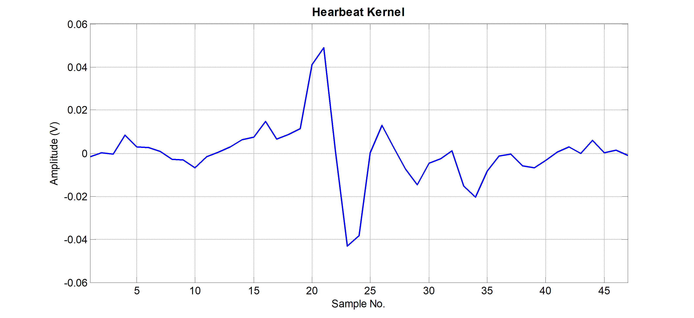
<figcaption><p>Fig The heartbeat kernel used for Matched
Filtering</p></figcaption>
</figure>

The whole signal is then convolved with the time-reversed conjugated
version of the heartbeat kernel. As the Doppler module outputs both
In-Phase (I) and Quadrature (Q) channels matched filtering must be
applied to both signals. The following code will implement this in
MATLAB:

``` matlab
% I & Q channels are convolved with time-reversed conjugated hb_kernel
match_filteredI = conv(data_I,hb_kernel(end:-1:1));
match_filteredQ = conv(data_Q,hb_kernel(end:-1:1));
% Ensures vector lengths are the same as the time vector
match_filteredI = match_filtered(1:max(size(time)));
match_filteredQ = match_filtered(1:max(size(time)));
```

Figure 26 shows the I-channel before and after matched filtering.
Although the signal after matched filtering has been suppressed in terms
of its absolute magnitude, it is clear to see that the pattern has
become clearer.

<figure>
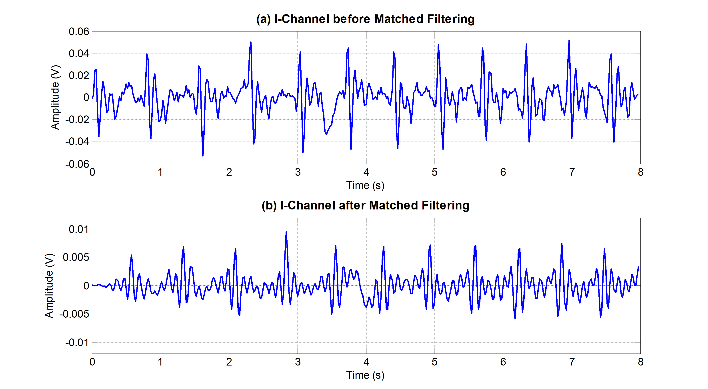
<figcaption><p>Fig (a) I-Channel without Matched Filtering (b) I-Channel
with Matched Filtering</p></figcaption>
</figure>

One method of obtaining the heart rate from both these signals is by
establishing a reference point in each heartbeat variation, such as the
positive peak, and determining their relative period; from this the
heart rate can be calculated. In Figure 26(a) the heart rate is worked
out to be 88 beats per minute and in Figure 26(b) the heart rate is
worked out to be 87 beats per minute.

The merit of using a matched filter is that it will detect the presence
of the kernel, making patterns in the signal more prominent. In this
case, the accuracy of the heart rate is retained. The fundamental flaw,
in the use of matched filters, lies when the kernel does not match the
pattern in the signal. For example, if the same process is applied to
the Q-Channel, where the variation of the signal is somewhat different
from that in the I-Channel, the matched filter is not as effective. This
is clearly shown in Figure 27.

<figure>
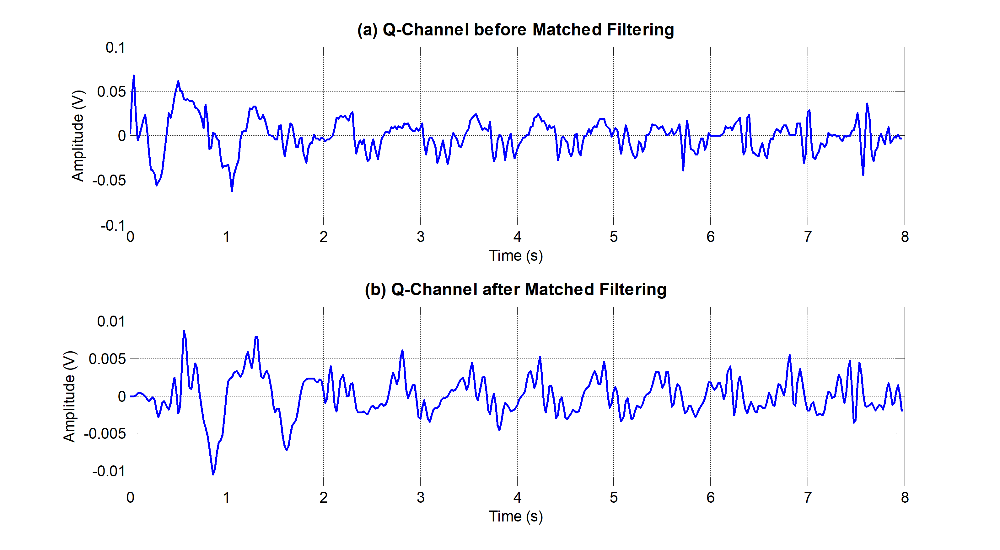
<figcaption><p>Fig (a) Q-Channel without Matched Filtering (b) Q-Channel
with Matched Filtering</p></figcaption>
</figure>

This drawback is the main reason why matched filtering cannot be used
for this algorithm. The pattern that is introduced by the heartbeat
varies from use to use. As the heartbeat kernel has a fixed shape, it is
rendered useless when the signal pattern varies. A dynamic kernel cannot
be used as it will be impossible to extract the right portion of the
signal; as measurements are not always started at the same stage of the
cardiac cycle.

### Continuous Wavelet Transform (CWT)

The Fourier Transform (FT) lends itself to the analysis of stationary
periodic signals. The signal obtained from the Doppler module is
periodic, but it does not have the characteristics of a stationary
signal and it is therefore necessary to apply a different analysis
technique. In this case, we are not only interested in the frequency
distribution in spectrum of the obtained signal, but also its frequency
distribution in time. \[[**22**](#WuW11)\]

The Continuous Wavelet Transform (CWT) has the attractive property of
decomposing a signal into the time/frequency domain, and therefore
allowing the analysis of specific frequency components over a time
distribution. Equation 18 defines the CWT: \[[**23**](#Mal97)\]

$`S(a,\tau) = \frac{1}{\sqrt{a}}\int_{}^{}{s(t)}\psi^{*}\left( \frac{t - \tau}{a} \right)dt`$
\[Eqn 18\]

Where$`\ a\`$is the scale of the transforming wavelet along the
frequency axis and$`\ \tau\`$is its translation along the time axis. The
integral in Equation 1 is seen as filtering the signal $`s(t)`$ through
a series of wavelet mother functions, translated by $`\tau`$ and dilated
by$`\ a`$.

There are a number of mother wavelet functions which can be used in the
CWT and one of the most commonly used is the Morlet mother wavelet. The
complex Morlet is given by Equation 19: \[[**24**](#LiH10)\]

$`\psi(x) = \pi^{- \frac{1}{4}}\left( e^{j\omega_{0}t} - e^{- \frac{1}{2}{\omega_{0}}^{2}} \right)e^{- \frac{1}{2}x^{2}}`$
\[Eqn 19\]

Where $`\omega_{0}`$ is the centre frequency of the wavelet and $`x`$ is
its associated bandwidth. A more robust method is to use the real part
Morlet wavelet as the mother wavelet and is given in Equation 20:
\[[**25**](#MAT11)\]

$`\psi(x) = e^{- \frac{1}{2}x^{2}}\cos(5x)`$ \[Eqn 20\]

Figure 28 shows the real part Morlet wavelet:

<figure>
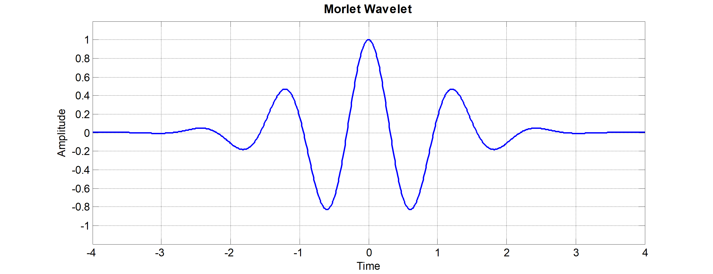
<figcaption><p>Fig Real part Morlet wavelet</p></figcaption>
</figure>

#### Example Waveform

The best way to demonstrate the usefulness of the CWT is through an
example. Figure 29 shows a non-stationary periodic signal which will be
used in this example. It consists of three sine waves of frequency 40
Hz, 20 Hz and 10 Hz, concatenated to form one signal waveform.

<figure>
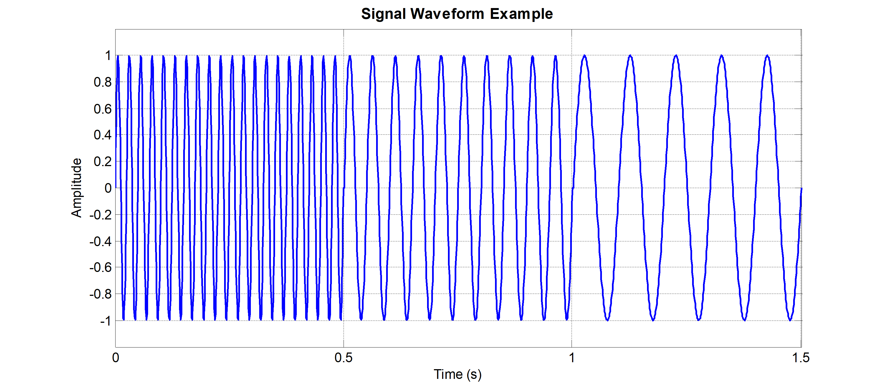
<figcaption><p>Fig Non-stationary periodic signal</p></figcaption>
</figure>

By performing the CWT on this signal, using the real part Morlet wavelet
as the mother wavelet, the frequency/time distribution can be obtained
and specific frequency coefficients can be isolated.

The following MATLAB code can be used to implement this example:

``` matlab
% Declaring the signal waveform
t=0:0.001:0.5;
y = [sin(2*pi*40*t) sin(2*pi*20*t) sin(2*pi*10*t)];
time=0:0.00098:1.5;
% Declaring frequency range of CWT
scale = (1:1:120);
% The scale values are converted to their pseudo-frequencies
F = scal2frq(scale,'morl',0.001);
% CWT
[coeffs] = cwt(y,scale,'morl', '3Dplot');
colormap(hot(256));
```

Figure 30 shows the 3D CWT plot of the example signal, where it is clear
to see the three different frequencies of the signal and their
subsequent positions in time. In this case we see both the positive and
negative coefficient values. Positive coefficients correspond to peaks
in the waveform and negative coefficients correspond to the troughs.

<figure>

<figcaption><p>Fig The CWT of the example signal waveform (3D
plot)</p></figcaption>
</figure>

A more informative view of this result can be obtained by plotting the
2D CWT of the example signal and is shown in Figure 31. The red areas
correspond to positive coefficients, whereas the blue areas correspond
to negative coefficients.

<figure>
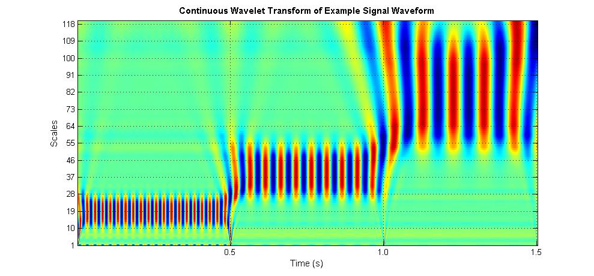
<figcaption><p>Fig The CWT of the example signal waveform (2D
plot)</p></figcaption>
</figure>

By looking at the pseudo-frequencies corresponding to the scale values
of the CWT, certain frequencies can be isolated. This is a useful tool
in the analysis of the Doppler module signal as the frequency deviation
induced by each heartbeat can be isolated and its periodic behaviour
analysed. Figure 32 shows the isolation of each of the frequencies in
the waveform, which is achieved by taking a tranche of the CWT relating
to a specific scale/frequency.

<figure>
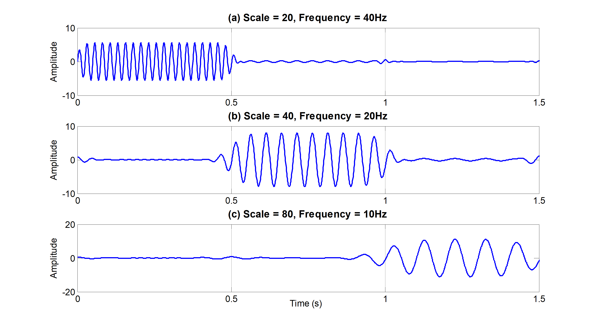
<figcaption><p>Fig (a) Isolated 40Hz section (b) Isolated 20Hz section
(c) Isolated 10Hz section</p></figcaption>
</figure>

Frequency and scale are linked by Equation 21. \[[**26**](#MAT111)\]

$`F_{a} = \frac{F_{c}}{a.\Delta}`$ \[Eqn 21\]

Where $`F_{a}`$ is the pseudo-frequency corresponding to the
scale$`\ a`$, in Hz; $`F_{c}\`$is the centre frequency of the Morlet
wavelet (0.8125 Hz); and $`\mathrm{\Delta}`$ is the sampling period of
the signal.

#### Real Doppler Signal

A real signal can now be introduced and the CWT can be calculated.
Figure 33 shows the I-Channel signal obtained from the Doppler module
and Figure 34 shows its corresponding 3D CWT.

<figure>
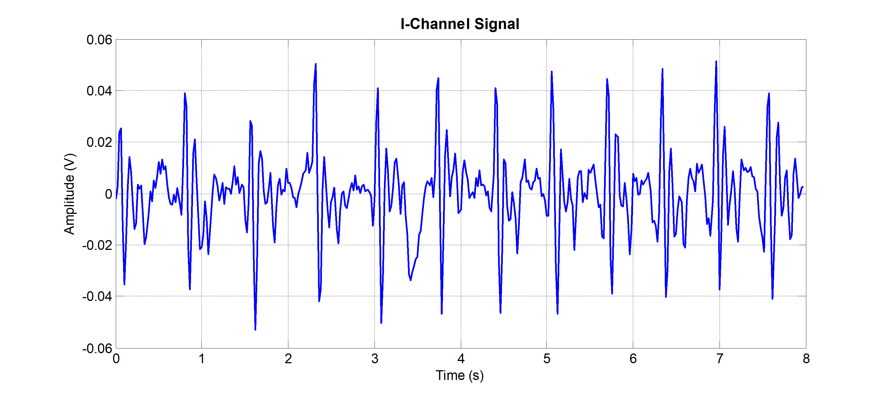
<figcaption><p>Fig I-Channel signal obtained from Doppler
module</p></figcaption>
</figure>

<figure>

<figcaption><p>Fig The CWT of the I-Channel Doppler signal (3D
plot)</p></figcaption>
</figure>

<figure>
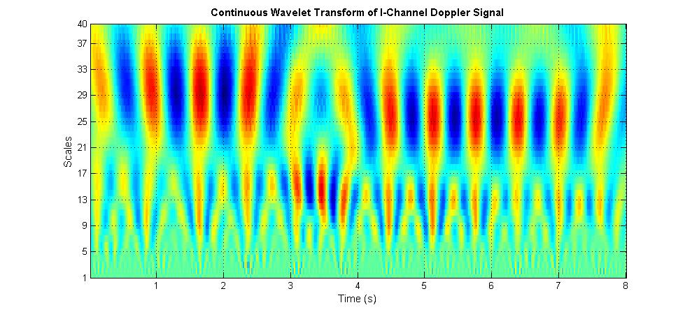
<figcaption><p>Fig The CWT of the I-Channel Doppler signal (2D
plot)</p></figcaption>
</figure>

There are two distinct levels of frequencies in this signal; those in
the scale range of 8-19 and those in the range of 20-37. By
concentrating on one of these ranges, which in this case will be the
more prominent range, the periodicity of the signal and subsequent heart
rate can be obtained. Using the same principle as before, specific
tranches of the CWT can be isolated. Figure 36 shows the least prominent
CWT tranche, whereas Figure 37 shows the most prominent CWT tranche.

<figure>
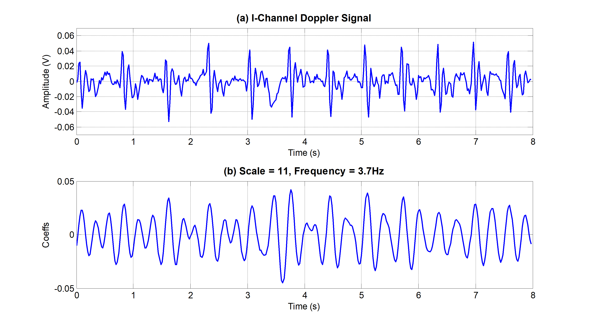
<figcaption><p>Fig (a) I-Channel Doppler signal (b) Least prominent CWT
tranche</p></figcaption>
</figure>

<figure>
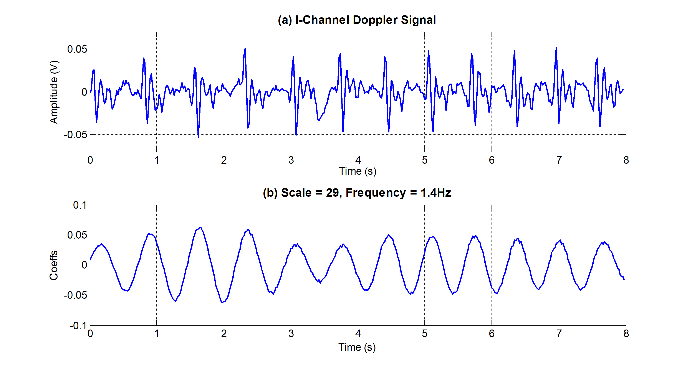
<figcaption><p>Fig (a) I-Channel Doppler signal (b) Most prominent CWT
tranche</p></figcaption>
</figure>

By isolating certain tranches of the CWT, useful information for
analysis can be obtained. Figure 36(b) shows that the higher range of
frequencies, corresponding to a lower range of scales, offers little in
terms of determining the periodicity of the heartbeat variations.
However, in Figure 37(b) the CWT tranche shows a well-defined peak for
each heartbeat variation in the time-domain signal. Therefore, this CWT
tranche can be used to establish the periodicity of the heartbeats, and
therefore establish the heart rate. Figure 38 shows the frequency
spectrum of this tranche.

<figure>
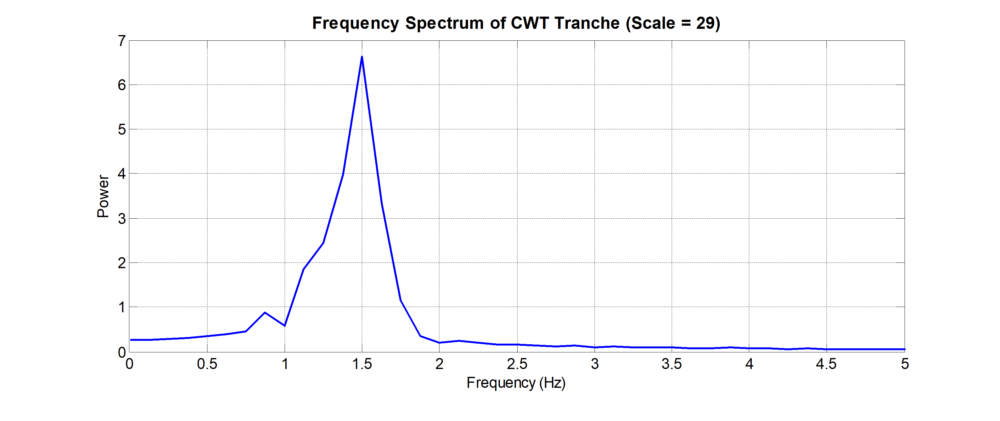
<figcaption><p>Fig Frequency Spectrum of the most prominent CWT tranche
(Scale = 29)</p></figcaption>
</figure>

The prominent peak at 1.5 Hz tells us that the heart rate in this case
is 90 beats per minute. Through the analysis of the time-domain signal,
which has 12 beats per 8 seconds, this calculated heart rate is correct.
Now we know that a specific element of the heartbeat variation in the
time-domain signal has a frequency around 1.4 Hz, this frequency tranche
can be isolated and lower frequencies induced by breathing can be
ignored.

The same principle of frequency tranche isolation can also be used to
determine the heart rate from the Q-channel Doppler signal. The
heartbeats induce a different time-domain variation in the Q-Channel
Doppler signal. Figure 39 shows this difference.

<figure>
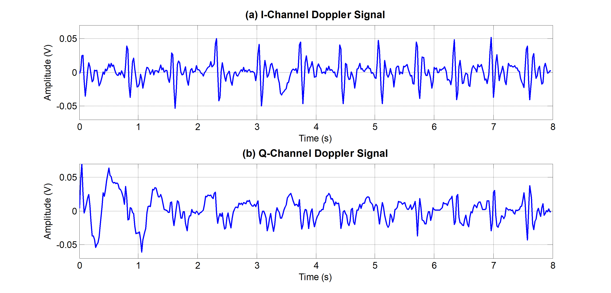
<figcaption><p>Fig (a) I-Channel Doppler signal (b) Q-Channel Doppler
signal</p></figcaption>
</figure>

By definition the In-Phase and Quadrature channels should be different;
however, in this case it is not only the phase that is different but
also the time-domain signal variation induced by each heartbeat. This
difference is the main reason why Spectrum Analysis & Matched Filtering
techniques are not effective. \[Sections 6.1.2 & 6.1.3\]

This limitation is overcome when using the CWT as it is the underlying
frequency of each heart beat variation which is analysed and not the
time-domain signal. Figure 40 shows the 2D CWT of the Q-Channel Doppler
signal and Figure 41 shows its 1.4 Hz frequency tranche (Scale = 29).
Again, by looking at the frequency spectrum of this tranche the heart
rate can be determined. Figure 42 shows the frequency spectrum of this
CWT tranche.

<figure>
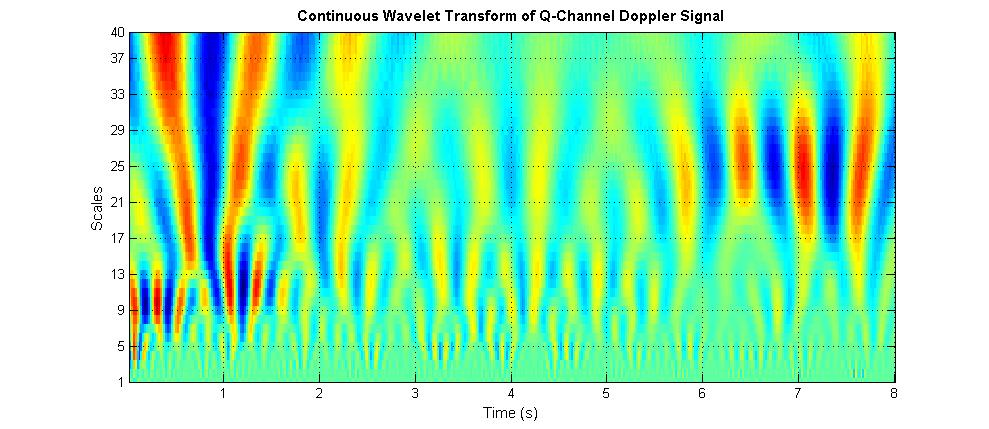
<figcaption><p>Fig The CWT of the Q-Channel Doppler signal (2D
plot)</p></figcaption>
</figure>

<figure>
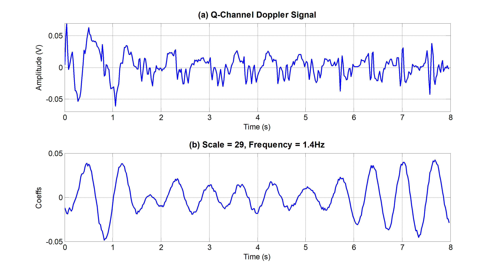
<figcaption><p>Fig (a) Q-Channel Doppler signal (b) 1.4Hz frequency
tranche (Scale = 29)</p></figcaption>
</figure>

<figure>
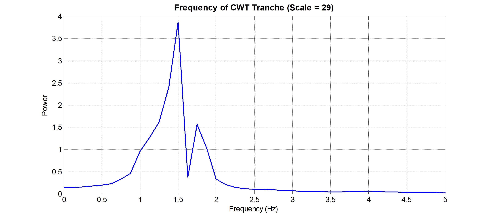
<figcaption><p>Fig Frequency Spectrum of the most prominent CWT tranche
(Scale = 29)</p></figcaption>
</figure>

The prominent peak at 1.5 Hz tells us that the heart rate in this case
is 90 beats per minute. This is exactly the same as what was calculated
from the I-Channel. So this method provides a more robust approach to
determining the heart rate. What needs to be established is whether it
can be used when the subject is also breathing.

## Development – Breathing

The noise introduced by the breathing motion of the chest presents a
more complex signal processing problem. The difference in the
time-domain signals can be seen in Figures 18 & 19. Section 6.1
describes the work that was carried establishing a robust algorithm that
could extract the heart rate from the Doppler signal without breathing.
Section 6.2 describes the implementation of these techniques on the
Doppler signal with breathing.

### Spectrum Analysis

As discussed in Section 6.1.2, the most straightforward way of finding
the periodicity of a signal is through performing a FFT on it. The most
prominent peak is then detected, which should correspond to the heart
rate (in the case of the subject holding their breath). In practice this
is quite difficult for a number of reasons, as discussed below:

- The amplitude of the signal is small in absolute terms and small
  compared to clutter noise. Therefore, the spectrum rarely exhibits any
  prominent peaks associated with the heartbeat variations.

- The exact Doppler signature of a heartbeat is not constant. It depends
  greatly on the person, heart rate, position, breathing pattern and
  many other factors which are hard to quantify and predict.

- Another problem is that depending on the absolute distance between the
  target and the antenna, and therefore position within the wavelength
  λ, the phase shift due to the heartbeats is decomposed into the I & Q
  channels differently. Even as the body shifts due to breathing, the
  position within the wavelength (12.5 mm) will change. This makes
  applying matched filtering practically impossible. We simply cannot
  anticipate what the signature will look like in each channel.

- As well as breathing the human body undergoes a lot of other
  movements, some of which we cannot control. These movements may be due
  to speaking, coughing, shifting around or any other deliberate
  movements. The amplitude of these movements is generally much larger
  than the amplitude of heart beat variations, introducing clutter noise
  and reducing the clarity of the received signal.

During the numerous tests that were conducted, where the objective was
to find some feature of the signal which would help identify the
heartbeat, it was noticed the following pattern often applied:

> > “The spectrum peak due to the heartbeat is likely to be contained in
> > the channel which does not exhibit the highest spectrum peak in the
> > region of 0.3 to 0.8 Hz”

This is illustrated in Figure 43. We could not come up with any
mathematical justification for this empirical rule, and it must be noted
that it does not always hold.

<figure>
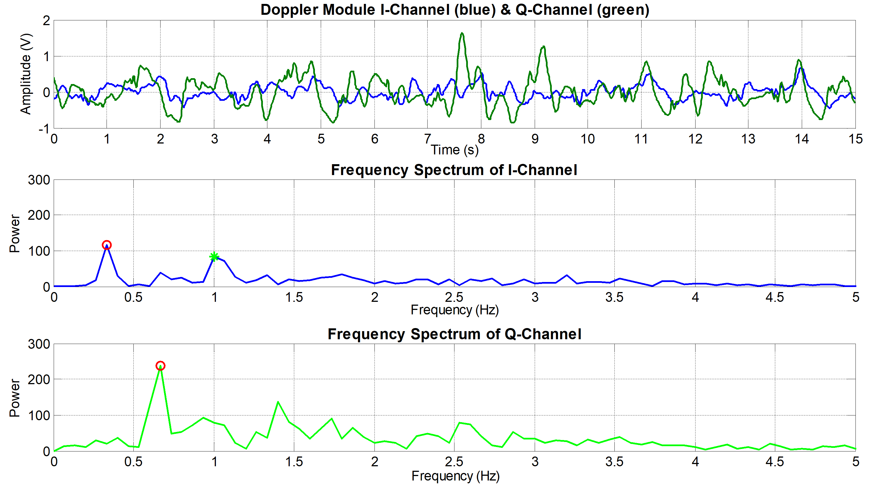
<figcaption><p>Fig Rule of thumb</p></figcaption>
</figure>

### Continuous Wavelet Transform (CWT)

The CWT can be used to isolate certain frequencies of a signal, while
still maintaining its variations through time. By isolating the
frequency corresponding to the heartbeat variations, the lower frequency
variations introduced by breathing can be ignored. Figure 44 shows the
I-Channel Doppler signal with breathing and Figure 45 shows its
respective 2D CWT.

<figure>
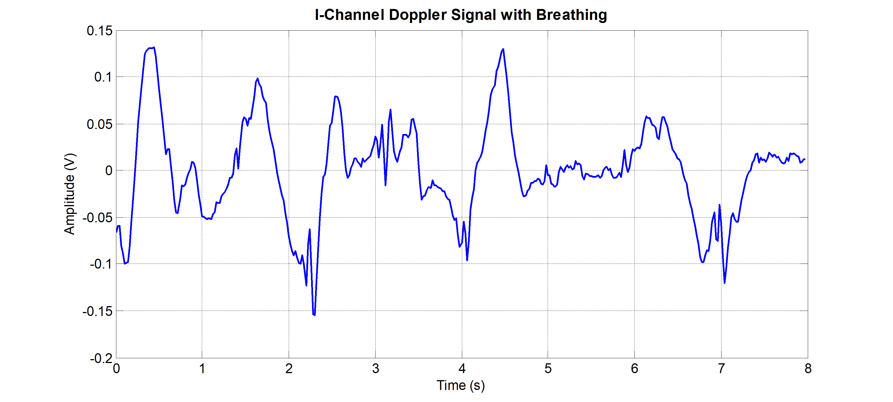
<figcaption><p>Fig I-Channel Doppler signal with
breathing</p></figcaption>
</figure>

<figure>
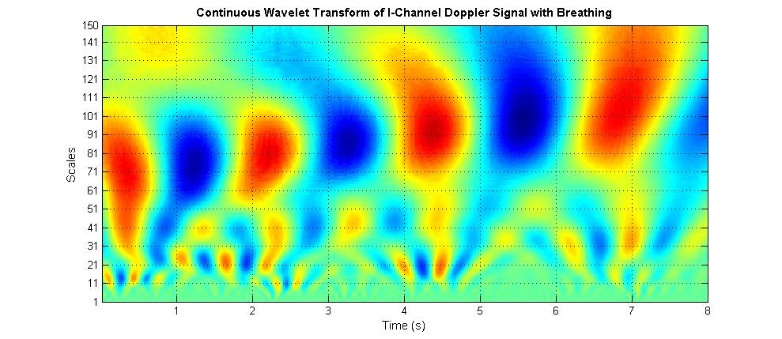
<figcaption><p>Fig The CWT of the I-Channel Doppler signal with
breathing (Scale Range: 1-150)</p></figcaption>
</figure>

In Figure 45 it is clear to see the frequency variations which arise
from the breathing motion. These variations occur at scale 90, whereas
the heartbeat variations occur around scale 29, equating to a frequency
of 1.4Hz. If the range of scales covered by the CWT is made smaller, the
heartbeat variations can be identified. This is shown in Figure 46.

<figure>
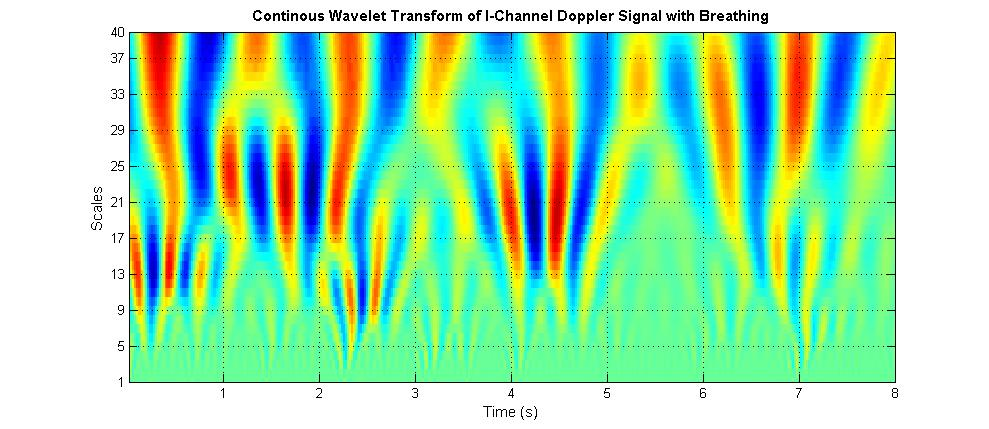
<figcaption><p>Fig The CWT of the I-Channel Doppler signal with
breathing (Scale Range: 1-40)</p></figcaption>
</figure>

Figure 47 shows the CWT tranches for a scale of 90, showing the
breathing frequency variation, and for a scale of 29, showing the
heartbeat frequency variation. Figure 48 shows their respective
frequency spectrums.

<figure>
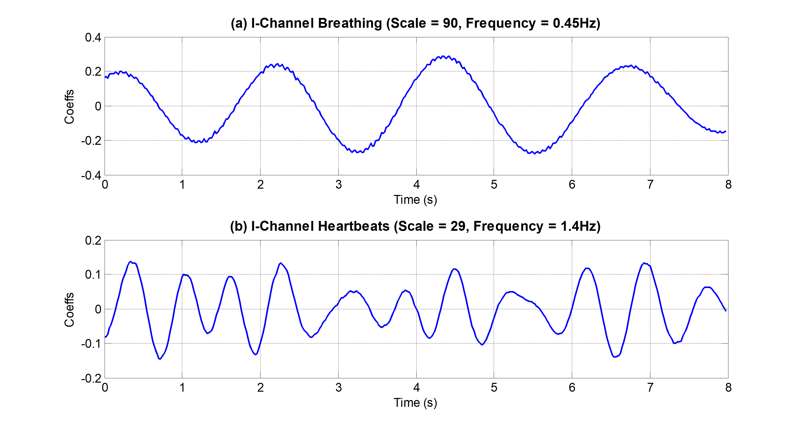
<figcaption><p>Fig (a) I-Channel breathing (b) I-Channel
heartbeats</p></figcaption>
</figure>

<figure>
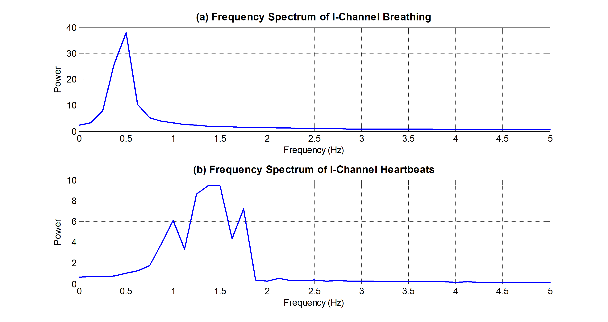
<figcaption><p>Fig (a) Breathing frequency spectrum (b) Heartbeats
frequency spectrum</p></figcaption>
</figure>

The breathing rate of the subject is revealed by the peak located at 0.5
Hz in Figure 48(a), which corresponds to a breathing rate of 30
respirational cycles per minute. Similarly, the heart rate of the
subject is revealed by the peak located at 1.4 Hz in Figure 48(b),
corresponding to a heart rate of 84 beats per minute. The same technique
can be applied to the Q-Channel Doppler signal. Figure 49 shows the
breathing frequency variations, with its respective frequency spectrum.
Figure 50 shows the heartbeat frequency variations, with its respective
frequency spectrum.

<figure>
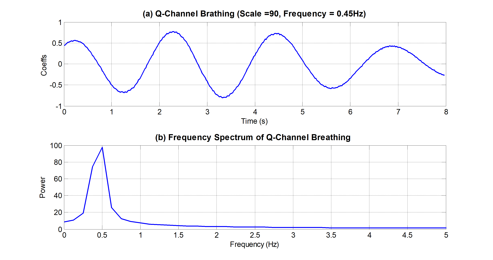
<figcaption><p>Fig (a) Q-Channel breathing (b) Q-Channel breathing
frequency spectrum</p></figcaption>
</figure>

<figure>
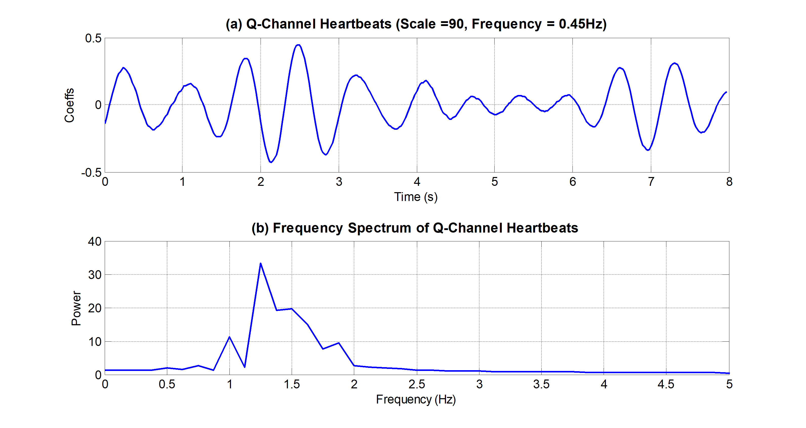
<figcaption><p>Fig (a) Q-Channel heartbeats (b) Q-Channel heartbeats
frequency spectrum</p></figcaption>
</figure>

The Q-Channel conveys essentially the same information as the I-Channel,
but there is a significant difference in the resultant heart rates. The
I-Channel heart rate was calculated to be 84 beats per minute, whereas
the Q-Channel is 75 beats per minute. In the pure heartbeat signals this
discrepancy did not exist and both channels gave the same heart rate.
The difference in calculated heart rate could have arisen from the lack
of sufficient spectral resolution, which could change the location of
the peaks. To increase the spectral resolution a longer sampling time
may be required.

Another way this discrepancy could be circumvented is to combine both
channels into a complex signal and performing the CWT on this signal.
The same technique of frequency isolation could then be applied. This
method would output a single heart rate value, which would be taken as
the conclusive heart rate. Figure 51 shows the heartbeat frequency
variations of the complex signal, along with its frequency spectrum.

<figure>
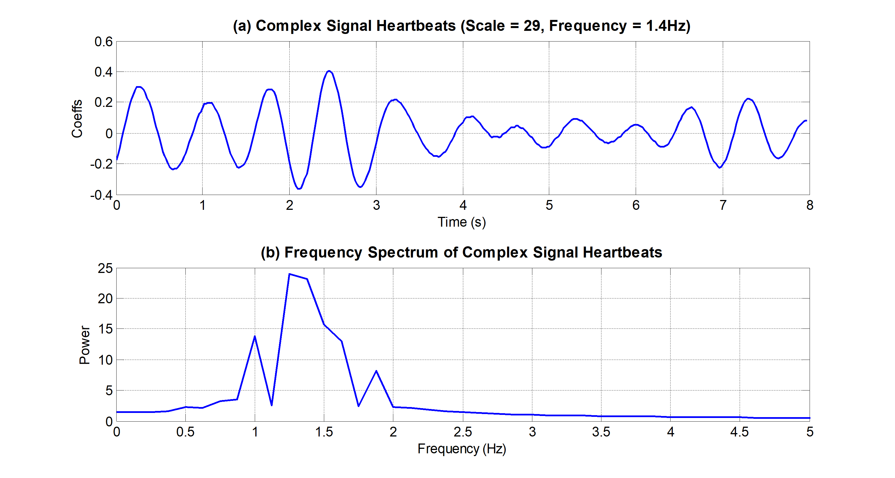
<figcaption><p>Fig (a) Complex signal heartbeats (b) Complex signal
heartbeats frequency spectrum</p></figcaption>
</figure>

The peak in this case is located at 1.25 Hz and corresponds to a heart
rate of 75, which is exactly the same as the heart rate calculated from
the Q-Channel in Figure 50. The fact that there is such a large
variation between the heart rates of each channel suggests that this
technique may not be as robust as once thought. By increasing the
overall sampling time better spectral resolution may be observed,
possibly leading to more accurate results.

### Unwrapped Phase

If the I & Q channels are combined into a complex signal, the phase of
this signal is given
by$`\ \varnothing = \tan^{- 1}\left( \frac{Q}{I} \right)`$. Now if the
phase is plotted against time the absolute movement of the chest is
revealed, as expected. However, the phase must be unwrapped in order to
overcome the frequent ±π jumps.

The limitation of this technique is that the absolute values can be
quite large when dealing with movements associated with breathing. The
movements associated with the heartbeats are very small in comparison.
The spectrum of the unwrapped phase is therefore very good for
determining the breathing frequency, but not effective at determining
the heart rate. Figure 52 shows the unwrapped phase plot for deep and
deliberate breathing. It is clear to see the movement associated with
breathing.

<figure>
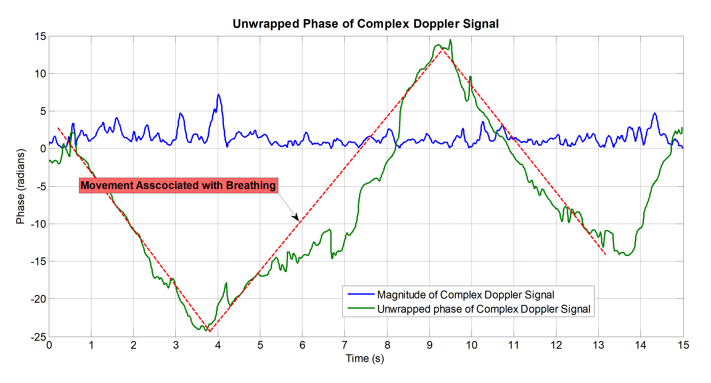
<figcaption><p>Fig Unwrapped phase for deep and deliberate
breathing</p></figcaption>
</figure>

The unwrapped phase is particularly sensitive to signal noise due to the
$`\tan^{- 1}`$ dependency. Small variations in the I & Q channels can
lead to large phase angles. From this, some plots may not have any
periodicity at all and may just drift in one direction because of noise.
This technique is therefore unreliable for deriving the fundamental
breathing frequency.

## Implementation

### Software Structure

The general structure of the software is shown in Figure 53. The user
code consists of three main logical parts: the display interface and
support functions; the data sampling; and the core algorithm. Although
the user code does interact with hardware directly, it uses the CMSIS
library to map peripheral addresses to human-readable names (e.g.
LPC_TMR0-\>MCR, which is Timer0 Match Control register). CMSIS also
provides start-up script that which sets up system clocks, interrupts
and exception handlers.

<figure>
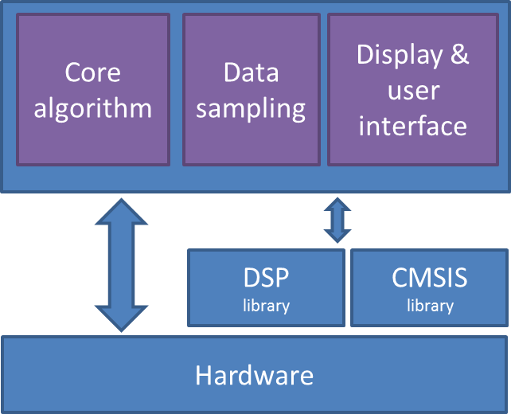
<figcaption><p>Fig Software structure</p></figcaption>
</figure>

The code itself is split up into files, as shown in Table 5, in order to
maintain a logical structure. Detailed code documentation has been
produced in a linked HTML format using the free tool Doxygen, available
in the electronic supplement part of this report.

| File | Operation |
|:--:|----|
| main.c | Contains the main application loop and interrupt handlers. |
| algorithm.c | Contains functions performing peak detection, maxima detection, interval filtering, etc… |
| utils.c | Contains support functions for LCD, SPI communication, serial (UART) and daily routines. |
| ADS1147.c | Functions to control and read data from ADC. |

Code files organisation

### Serial Link

During the software programming and debugging process it became apparent
that a mechanism to check intermediate calculation results, carried out
by the microcontroller, was necessary. The solution was to implement a
serial link comprised of a serial-to-USB converter and Matlab interface
script. This link is in one direction only, from microcontroller to PC.
To identify the raw data a control packet was used, shown in Table 6.

<table>
<caption><p>Control packet</p></caption>
<colgroup>
<col style="width: 12%" />
<col style="width: 8%" />
<col style="width: 11%" />
<col style="width: 21%" />
<col style="width: 11%" />
<col style="width: 14%" />
<col style="width: 13%" />
<col style="width: 6%" />
</colgroup>
<thead>
<tr>
<th style="text-align: center;">Size (bytes)</th>
<th style="text-align: center;">1</th>
<th style="text-align: center;">2</th>
<th style="text-align: center;">1</th>
<th style="text-align: center;">1</th>
<th style="text-align: center;">16</th>
<th style="text-align: center;">2</th>
<th style="text-align: center;">1</th>
</tr>
</thead>
<tbody>
<tr>
<td style="text-align: center;">Offset</td>
<td style="text-align: center;">0</td>
<td style="text-align: center;">1</td>
<td style="text-align: center;">3</td>
<td style="text-align: center;">4</td>
<td style="text-align: center;">5</td>
<td style="text-align: center;">21</td>
<td style="text-align: center;">23</td>
</tr>
<tr>
<td style="text-align: center;">Value</td>
<td style="text-align: center;">START</td>
<td style="text-align: center;">N</td>
<td style="text-align: center;">Type</td>
<td style="text-align: center;">Command (Reserved)</td>
<td style="text-align: center;">Description String</td>
<td style="text-align: center;">Sample Rate (Hz)</td>
<td style="text-align: center;">END</td>
</tr>
<tr>
<td style="text-align: center;">Explanation</td>
<td style="text-align: center;">= 23</td>
<td style="text-align: center;"><p>0…2<sup>16</sup></p>
<p>Total size of data in bytes in upcoming data packet</p></td>
<td style="text-align: center;"><p>0 = unsigned char (8 bit)</p>
<p>1 = signed char (8 bit)</p>
<p>2 = unsigned int (16 bit)</p>
<p>3 = signed int (16 bit)</p>
<p>4 = 32-bit float</p></td>
<td style="text-align: center;"></td>
<td style="text-align: center;">Used to identify the data (must be set
correctly)</td>
<td style="text-align: center;">Used for plotting correct frequency or
time axis for the data</td>
<td style="text-align: center;">= 13</td>
</tr>
<tr>
<td colspan="8" style="text-align: center;">Total size = 24 bytes
(constant). All data is transmitted LSB-first.</td>
</tr>
</tbody>
</table>

A Matlab script runs a loop which reads the control packet and parses
it. Based on the description string and other parameters the proceeding
data is saved in the appropriate format for further processing.

### Data Sampling

The choice of length of FFTs in the DSP library is limited to 128, 512
and 2048 points. To obtain the maximum achievable frequency resolution,
it is prudent to go with the largest length, 2048 samples. This length
requires an integer number of seconds of the sampled signal to make
calculations convenient. A suitable value is 16 seconds, which gives an
effective sampling rate of (2048/16) = 128 SPS. For an oversampled
signal, the raw sampling rate of the ADC will be equal to 128 SPS
$`\times`$ 2 (channels) $`\times`$ M, where M=1, 2, 4, 8…

As it was mentioned earlier, the maximum sampling rate of the ADS1147,
that maintains 16 bit resolution, is 320 SPS for a single channel. This
equates to 160SPS for two channels. From Section 7.1.1 it was found that
oversampling the signals gave us better SNR. It is clear however that
160 SPS in not enough to oversample the signal even by a factor of 2.
Therefore it was decided to sample the I & Q channels with both the
built-in ADC and the ADS1147 chip. This would give us the benefit of
high resolution from the ADS1147 and high speed form the built-in ADC.

The built-in ADC can be triggered by the 32-bit timer to make sure that
the sampling intervals are constant. If the microcontroller runs at 40
MHz, the timer clock is 10 MHz. If the timer starts counting from zero
and the match value is 78125, it gives the required interrupt rate of
128 Hz. We can only sample one channel at a time, so to sample both
channels at this rate a timer interrupt rate of 256 Hz is required.
Multiplying this rate by powers of 2 will make the built-in ADC run
faster to enable oversampling. The increased sampling rates are not
possible to achieve with integer timer match values, and a very small
sample rate error will be introduced. Table 7 shows the final sampling
rates for different oversampling rates and timer match values.

| Oversampling Factor, M | Timer Match Value | Effective Sampling Rate |
|:----------------------:|:-----------------:|:-----------------------:|
|           1            |      39,063       |         127.998         |
|           2            |      19,531       |         128.001         |
|           4            |       9,766       |         127.995         |
|           8            |       4,883       |         127.995         |

Oversampling rates with their corresponding real sampling rates

If the ADS1147 is used, the conversion time for a given nominal
conversion rate is fixed; however, effective sampling rate can be
controlled using a START pin. As long as the START pin is held high, it
will continuously sample a selected channel and pull DRDY low as soon as
the conversion result becomes available. The sample rates of the ADS1147
are fixed, where the two closest ones to the desired rate are 80 SPS or
160 SPS. Clearly, these are nowhere near 128 SPS. Alternatively, the
START pin can be taken high at appropriate intervals to obtain the
desired rate. This is illustrated in Figure 54.

<figure>
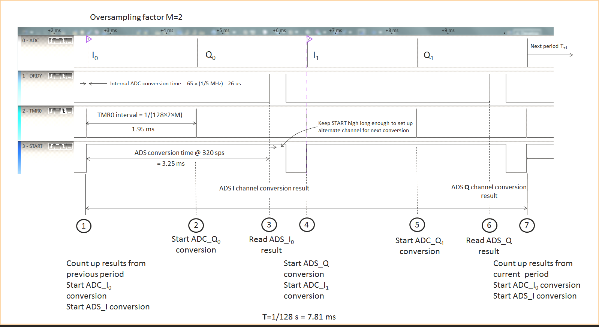
<figcaption><p>Fig Timing diagram for oversampling with
ADS1147</p></figcaption>
</figure>

Figure 54 is rather complex, but it is important as it describes the key
operations of the sampling process. The four signals shown are as
follows.

- **ADC**: This is not an actual electrical signal.

  - High level indicates when ADC interrupt on conversion complete
    occurs.

- **DRDY**: Output signal from ADS that indicates the conversion is
  complete.

- **TMR0**: This is not an actual electrical signal.

  - High level indicates when Timer0 overflow interrupt occurs.

- **START**: Input signal to ADS.

  - Pulled high by the microcontroller to trigger the start of a
    conversion.

I channel samples within one period are designated as I<sub>n</sub>
where n=0…M-1, and the Q samples are designated in the same way. The
duration of the fundamental period T is $`\frac{1}{128}`$ seconds,
corresponding to effective sampling rate of the system for both
channels. Within that period, both I & Q channels must be sampled
exactly once by the ADS1147, and up to 8 times by the built-in ADC. In
the diagram, the demonstrated oversampling rate M is equal to 2, so both
I & Q are sampled twice by the built-in ADC.

The numbered operations shown in Figure 54 are described below:

1.  The ADS_I conversion is started. The built-in ADC input is set to
    I-Channel and the ADC_I<sub>0</sub> conversion is started. The
    accumulators for I & Q channel sample values are set to 0. Once ADC
    conversion completes the result is added to the corresponding
    accumulator. If the finger sensor is enabled, the ADC input is set
    to the finger sensor signal and conversion is performed. Result is
    stored directly in its intermediate buffer, as it is not
    oversampled.

2.  ADC input is changed, and ADC_Q<sub>0</sub> channel conversion is
    started. Once completed it is added to its accumulator.

3.  DRDY signal goes high. The ADS_I conversion result is retrieved over
    the SPI bus and added to the I-Channel accumulator. The ADS input
    channel is changed, but the conversion is not initiated.

4.  ADC_I<sub>1</sub> conversion is performed and stored. ADS_Q
    conversion is initiated by pulling the START signal high.

5.  ADC_Q<sub>1</sub> conversion is performed and stored.

6.  The ADS_Q conversion result is retrieved and stored. The ADS input
    is set to I-Channel, ready for next period.

7.  The final sample values for the current period, T, are calculated
    (averaged) and stored in the intermediate buffer. The sample value
    conditioning and averaging process is discussed in Section 7.3.4. If
    the position within the intermediate buffer is 127, the flag is set
    which indicates that intermediate buffer is full and is ready to be
    copied into the main array. The main application loop detects this
    flag and initiates the copying and algorithm processing. Next period
    T<sub>+1</sub> starts.

### Sample Value Conditioning & Averaging

The analogue signal ranges and corresponding sample values are shown in
Figure 55. Unlike the ADS1147 sample values, the built-in ADC values are
unsigned and have 12 bit length. To bring them to the same range and
format as the ADS1147 sample values, they must be multiplied by 16 and
mean-centered. This is carried out by Equation 22.

$`Sample\_ value = \left( {ADC}_{value} \times 16 \right) - 32768`$
\[Eqn 22\]

The equivalent C statement is: Sample_value=(ADC_value\<\<4)-0x8000;

<figure>
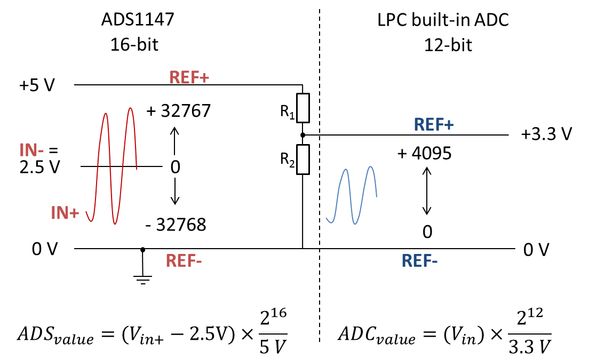
<figcaption><p>Fig Normalisation</p></figcaption>
</figure>

This normalisation is done before the built-in ADC values are added to
the accumulator, which is 32 bits long to prevent a possible overflow.
In the current implementation, ADS1147 samples are always given a
weighing of 0.5 in the final sample value, and the average of the
built-in ADC samples is given weighting of 0.5. This is illustrated
graphically in the Table 8, and mathematically through Equation 23.

|  Values   | ADS_I | ADC_I<sub>0</sub> | ADC_I<sub>1</sub> |
|:---------:|:-----:|:-----------------:|:-----------------:|
| Weighting |  0.5  |       0.25        |       0.25        |

Sample value weighting

$`Sample\_ I = \frac{\left( \frac{{ADC\_ I}_{0} + {ADC\_ I}_{1} + \ldots + {ADC\_ I}_{M - 1}}{M} + ADS\_ I \right)}{2}`$
\[Eqn 23\]

This weighting is fairly arbitrary, but simple to implement and has
shown to produce accurate results with noise levels smaller than when
sampling with the ADS1147 alone. Taking samples from two independent
converters allows the suppression of systematic errors associated with
individual converters.

### Sampling Noise

The noise performance of the ADC process on the final PCB design was
measured and compared to that of prototype PCB, which used the NI-DAQ as
ADC. The noise value figures were obtained by subtracting the mean value
(DC offset) from the raw-time domain samples, finding the RMS value of
the 16-second period, and converting the result into Volts; as shown in
Equation 24. The samples from NI-DAQ are already in volts, so the RMS
value was simply computed after removing the mean value.

$`\frac{RMS\ value\ of\ the\ samples\ over\ 16\ seconds}{2^{16}} \times 5\ V`$
\[Eqn 24\]

To determine the noise floor, measurements were taken when the Doppler
module was both connected and disconnected. When disconnected the I & Q
channel inputs were grounded. When connected it was ensured there was no
movement in front of the sensor.

<table style="width:81%;">
<caption><p>Noise floor measurements</p></caption>
<colgroup>
<col style="width: 32%" />
<col style="width: 27%" />
<col style="width: 21%" />
</colgroup>
<thead>
<tr>
<th style="text-align: center;"></th>
<th colspan="2" style="text-align: center;"><strong>Average RMS Noise
(mV)</strong></th>
</tr>
</thead>
<tbody>
<tr>
<td style="text-align: center;"><strong>PCB Arrangement</strong></td>
<td style="text-align: center;"><strong>Doppler Module
Disconnected</strong></td>
<td style="text-align: center;"><strong>Doppler Module
Connected</strong></td>
</tr>
<tr>
<td style="text-align: center;">ADS1147 + built-in ADC</td>
<td style="text-align: center;">7.4</td>
<td style="text-align: center;">9.5</td>
</tr>
<tr>
<td style="text-align: center;">NI-DAQ</td>
<td style="text-align: center;">0.85</td>
<td style="text-align: center;">6.0</td>
</tr>
</tbody>
</table>

It can be seen that the ADS1147 + built-in ADC PCB has a noise floor
around 10 times higher than the NI-DAQ PCB. The explanation for this is
most likely to be the cross-talk between the analogue inputs and the
digital IO lines, as well as the serial communication link. When the
Doppler module is connected, the levels of noise are comparable.

### Data Buffering

During the operation of the algorithm, it is clear that the array with
raw time-domain samples must remain constant for all the calculations to
be consistent. New samples cannot be written to it during the algorithm
calculations. To facilitate that, the data samples from the built-in ADC
and the ADS1147 are stored in an intermediate buffer as opposed to the
main buffer, which is used for FFT and other calculations. The resultant
buffering process and structure is illustrated in the Figure 56.

<figure>
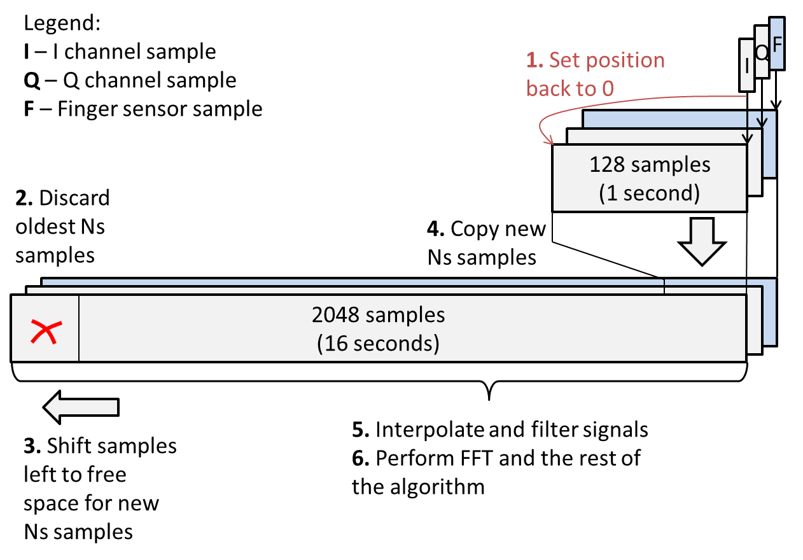
<figcaption><p>Fig Buffering process and structure</p></figcaption>
</figure>

After the system is powered up and initialised, samples from the I & Q
channels are calculated, as described in Sections 6.3.3 & 6.3.4, and
stored in their respective intermediate buffers, starting from position
0. When the intermediate buffers are full the data in the main buffers
is shifted left by 128 samples, discarding it and making space for new
data. Then, the intermediate buffers are copied in at the end of their
respective main buffers. After that, the algorithm processing is
initiated. The algorithm can run for up to a second before the data is
overwritten, which allows plenty of time for quite complex calculations.

### Floating Point Calculations

The serial link to MATLAB allows the comparison between the fixed-point
calculation results and the MATLAB floating point results, helping to
detect any errors before they cause obscure bugs.

The samples are stored in Q15 fixed-point format, as shown in Figure 57.
This means that the number is stored in a 16 bit container (signed short
int type in C), which has a virtual decimal point between bits 15 and
16. The 16<sup>th</sup> bit is the sign bit, representing a negative
number in 2’s compliment arithmetic when it is 1. In this format, the
numbers are represented as fractional values between 0.999969482421875
and -1 (2<sup>0</sup>-2<sup>-15</sup> … -2<sup>0</sup>). It has to be
noted that the decimal point only exists in context of arithmetic
operations and human representation, and does not change the binary data
in any way.

<figure>
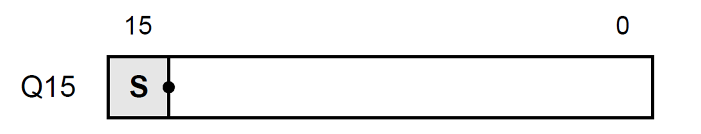
<figcaption><p>Fig Q15 fixed-point format</p></figcaption>
</figure>

After testing the data acquisition code and verifying the operation of
the buffers, the 2048-point Q15 FFT was performed. Once the result was
sent to MATLAB through the serial link, it was noticed that the
magnitude of the result was 0 most of the time. However, after some
observation it became clear that the spectrum magnitude was not always
0; it did show up for relatively large signal amplitudes at a particular
frequency, as shown in Figure 58.

Signal amplitude

Spectrum magnitude

<figure>
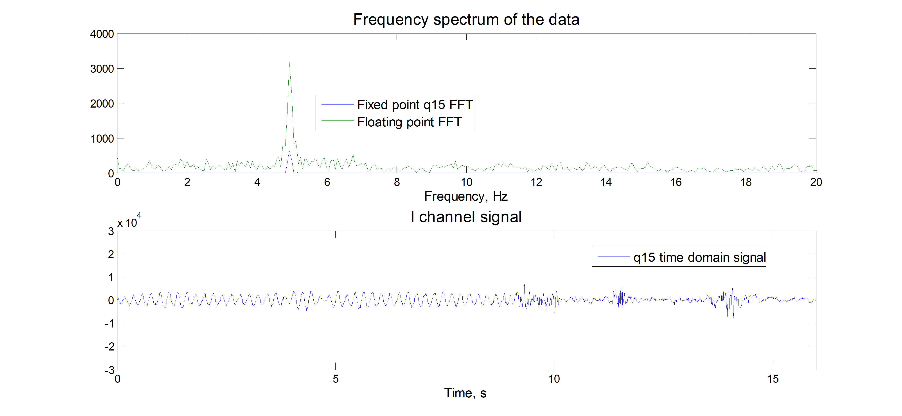
<figcaption><p>Dominant frequency</p></figcaption>
</figure>

Fig 58 Fixed point and floating point FFT comparison

The raw time-domain signal was also sent to MATLAB, which performed a
double-precision FFT on it. In Figure 58, both FFT outputs show the
dominant frequency peak correctly; however, for all the other
frequencies which are small but non-zero, the Q15 FFT output is 0.

The FFT involves a lot of multiply-and-add operations, and considering
that samples are quite small and have values with different signs,
calculations with round-off error result in a zero. A few experiments
with up-scaling raw samples and intermediate results did not improve the
output, or introduced overflow errors. It became clear that floating
point FFT was required for our application. Fortunately, the ARM DSP
library provides optimised single-precision FFT functions.

After changing the code to floating-point operation, the operation was
verified. This time, both embedded and MATLAB implementations produced
essentially the same result. There were some minor differences, but this
is can be attributed to the difference between single and
double-precision arithmetic.

### Algorithm Outline 

The algorithm is split into two independent parts: the operations on the
Doppler sensor data; and the operations on the finger sensor data. The
aim of the project is to measure the heart rate using Doppler sensor
data only. The finger sensor (F-Channel) was found to be a more reliable
and robust way of measuring heart rate, but it requires physical contact
with the sensor. In our project it is used to verify the heart rate
value obtained from Doppler sensor data.

The outline of the operation of the algorithm is as follows:

- Wait for the new one-second blocks of data to be ready (for I, Q and F
  channels).

- Copy the new data blocks into their respective main 16-second arrays.

- <u>I-Channel:</u>

  - Convert and copy time-domain sample values to a floating-point
    array.

  - Perform floating-point FFT.

  - Find the spectrum magnitude.

  - Find 3 largest peaks in spectrum magnitude.

  - Estimate HR.

- <u>Q-Channel:</u>

  - Repeat I-Channel steps.

- Consolidate information from both channels to arrive at the final
  estimate of heart rate

- <u>F-Channel:</u>

  - Copy to a scratch buffer (FFT modifies the original data).

  - Perform fixed-point Q15 FFT on the scratch buffer, and find the
    spectrum magnitude.

  - Find the highest peak in the region 0.9 – 2.5 Hz.

    - This corresponds to a rough estimate of the heart rate.

    - Calculate corresponding estimated interval between the heartbeats.

  - Find the heartbeats peaks in the time-domain signal.

  - Compute the differences between the peak positions and intervals.

  - Filter the intervals to eliminate erroneous and missing peaks.

  - Find the mean value of filtered intervals.

    - Derive a precise estimate of the heart rate.

The I & Q Channel operations and F-Channel operations are described in
more detail in Section 6.3.8.1 and Section 6.3.8.2 respectively.

#### I & Q Channel Operations

Figure 59 shows an illustration of the I & Q Channel algorithm
operations. It should be noted that all the calculations are carried out
on the microcontroller, and the data is only passed to MATLAB for
displaying. As such, the portable device is completely stand-alone as
specified.

<figure>
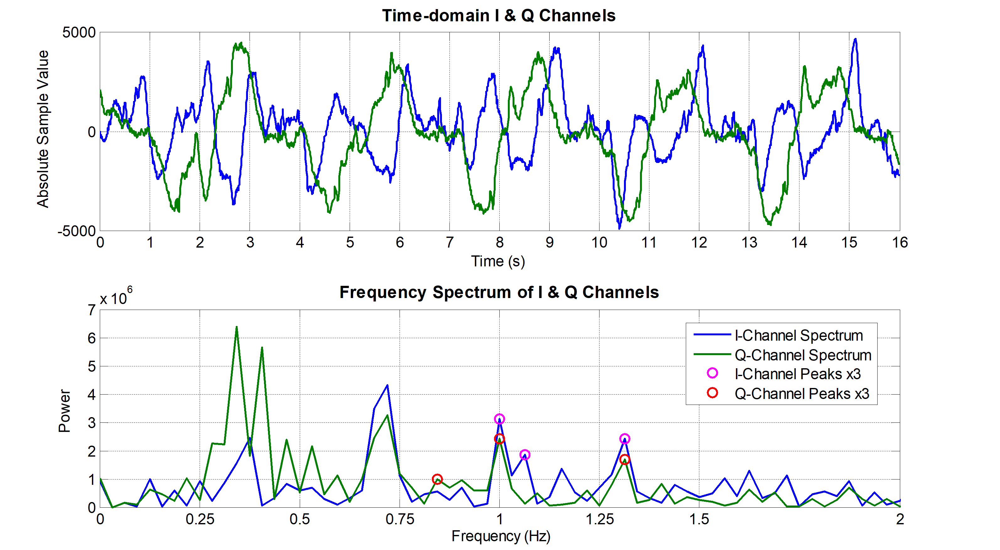
<figcaption><p>Fig I &amp; Q Channel algorithm
operations</p></figcaption>
</figure>

The new value of the heart rate in each channel is found by weighting
the positions of three highest spectrum values
(x<sub>1</sub>…x<sub>3</sub>) by their height
(val<sub>1</sub>…val<sub>3</sub>), and inversely weighting them by the
difference from the last heart rate (d<sub>1</sub>…d<sub>3</sub>). This
way, maxima that are significantly different from the last estimate are
weighted down. The maxima are only found within the interval from 0.8 Hz
to 1.6 Hz, corresponding to heart rates between 48 and 96 bpm. Below
that maxima are likely to represent breathing, above that they can be
attributed to harmonics.

The final estimate is found by taking the average of the I & Q channel
estimates. Looking at only the highest peak in the spectrum is not
suitable, as the highest peak may shift around from cycle to cycle,
somewhat randomly. This is a rather simplistic way of estimating the
heart rate, but no other estimation method was found during the project
that achieved better performance. An illustration of this estimation
process is shown in Figure 60.

<figure>
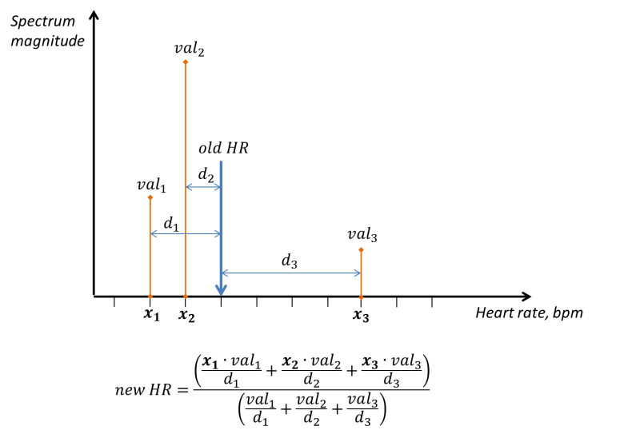
<figcaption><p>Fig Heart rate estimation process</p></figcaption>
</figure>

The formula which governs this estimation process is given by Equation
25.

$`new\ HR = \frac{\left( \frac{x_{1} \times val_{1}}{d_{1}} + \frac{x_{2} \times val_{2}}{d_{2}} + \frac{x_{3} \times val_{3}}{d_{3}} \right)}{\left( \frac{val_{1}}{d_{1}} + \frac{val_{2}}{d_{2}} + \frac{val_{3}}{d_{3}} \right)}`$
\[Eqn 25\]

#### F-Channel Operations

Figure 61 is a convenient representation of the F-Channel algorithm
operations and illustrates how the heart rate is calculated from the
finger sensor signal.

<figure>
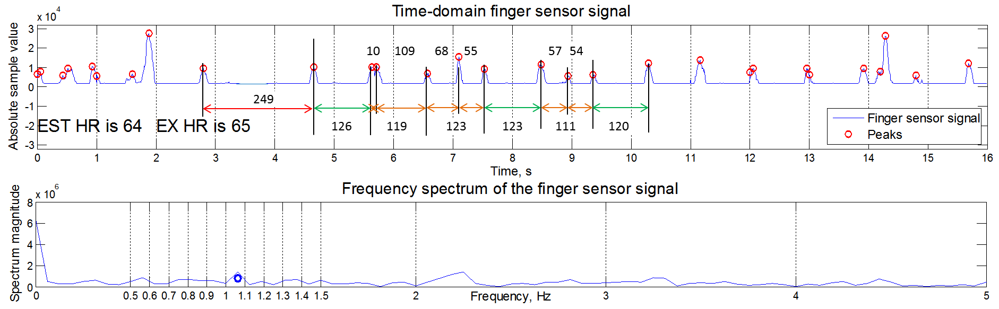
<figcaption><p>Fig F-Channel algorithm operations</p></figcaption>
</figure>

Firstly, the spectrum magnitude is calculated from the raw finger sensor
signal data, shown in Figure 61. Fixed-point FFT is sufficient for this,
because the signal amplitude is large, and spectrum peaks are not lost
due to round-off errors. The highest peak is identified in the region
0.9 – 2.5 Hz, corresponding to heart rates in the range of 54 – 150 bpm.
Special measures are taken to make sure the second harmonic is not
detected instead of the fundamental. The peak is marked with a blue
circle. Its position is 136 in the spectrum array, corresponding to a
frequency of 136 $`\times`$ $`dF`$ = 1.0625 Hz and an estimated heart
rate of 64 bpm. This heart rate corresponds to an expected peak spacing
of:

``` math
\frac{60\ bpm/Hz}{64\ bpm} \times 128\ samples \bullet Hz = 120\ samples
```

The interval tolerance to account for deviation in individual heart beat
intervals is set to 10%, which equals to ± 12 samples. In other words,
the intervals that lie within the range of 108 – 132 samples are
accepted.

Next, the time-domain peaks are detected using the valley-trough method,
shown with red circles in Figure 61. The intervals are computed as
differences between the peak positions. The raw data peaks may include
some spurious peaks due to finger movement, and some missed peaks too.
Including all of them in heart rate estimation would lead to inaccurate
results. Therefore the raw interval values are filtered as illustrated
in Figure 61.

The filtering process can be explained by three cases:

- Interval *lies within* the expected interval tolerance: accept it and
  move to next one.

  - This is shown with green arrow lines.

- Interval is *larger* than the expected interval tolerance: discard it
  and move to next one.

  - This is shown with red arrow lines.

- Interval is *smaller* than the expected interval tolerance: start the
  cumulative loop:

  - If the sum is *less* than interval tolerance:

    - Continue adding up.

  - If the sum is *within* interval tolerance:

    - Accept the sum value and go to following interval.

  - If the sum is *larger* than interval tolerance:

    - Discard and restart from next interval after sum counting
      beginning.

Referring to Figure 6 and following the outlined algorithm, from left to
right the annotated values are:

- 249 🡪 too large 🡪 discarded.

- 126 🡪 within tolerance 🡪 accepted.

- 10 + 109 = 119 🡪 within tolerance 🡪 accepted.

- 68 + 55 = 123 🡪 within tolerance 🡪 accepted

After the intervals are filtered, the average interval is calculated.
The heart rate is then calculated using Equation 26.

$`HR = \frac{128}{mean(filtered\_ intervals)} \times 60`$ \[Eqn 26\]

The value calculated is the average heart rate over the past 16 seconds,
which is the length of the data. For the case discussed above the heart
rate is 65 bpm, which is very close to the original estimate of 64 bpm.
However, it can be seen that even the intervals between individual beats
may vary by up to around 10% in a completely healthy individual. We can
obtain the value of the instantaneous heart beat by just using the last
valid interval, or we can average the intervals for any number of
seconds to obtain a longer-term average.

The variation in individual heartbeat intervals puts under question
possibility of detecting** **heart dysrhythmia using the finger sensor,
let alone the Doppler signal. From a heart rate detection point of view,
this spread in interval values results in spread of the spectrum peak,
making it harder to detect and track. 

# Results

The most obvious way to establish the accuracy of the Doppler module
results is by plotting them along with the finger sensor results over a
certain length of time. This is shown in Figure 62.

<figure>
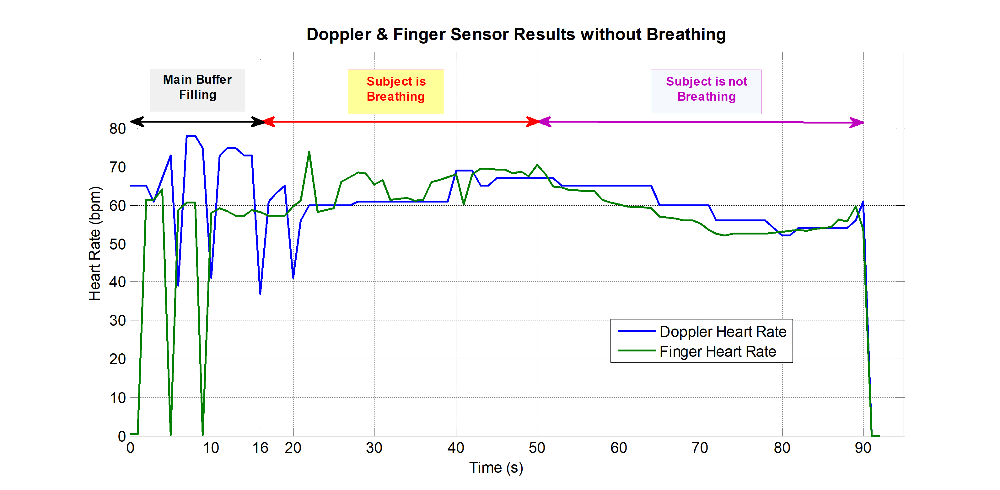
<figcaption><p>Fig Doppler &amp; Finger sensor results without
breathing</p></figcaption>
</figure>

During the first 16 seconds the main buffer is still being filled, so
the results are completely inaccurate. After that, the finger sensor
locks onto the heart rate but the Doppler sensor still takes some time
to display accurate results. In Figure 62, the subject is holding their
breath from 50 seconds onwards. Figure 63 shows the same plot for a
subject who is breathing throughout the measurements.

<figure>
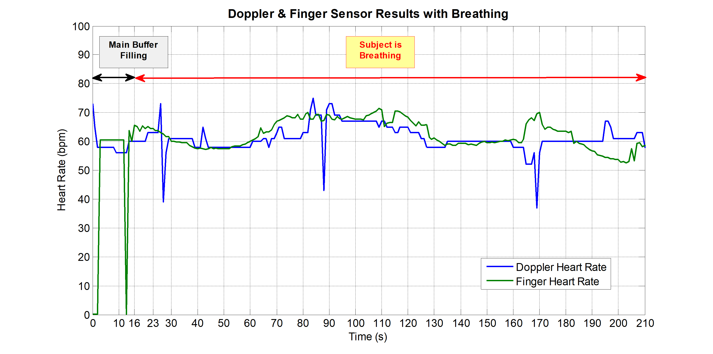
<figcaption><p>Fig Doppler &amp; Finger sensor results with
breathing</p></figcaption>
</figure>

# Conclusion

To conclude, it is correct to say that the revised aim of developing a
portable device which could accurately determine the heart rate of a
subject through contactless means was achieved. Although this aim was
achieved, there is a severe limitation to the accuracy of the device,
relating to the magnitude of clutter motion that is acceptable before
inaccurate results are obtained.

In addition to the contactless Doppler sensor, a blood oximetry-based
finger was designed and built in order to provide an accurate reference
measure of the heart rate for development purposes. In the results
section, it is demonstrated that the results derived from the Doppler
sensor do correlate with those derived from the finger sensor, albeit
under a limited set of conditions.

As mentioned, non-cardio-respiratory motion poses a severe problem to
the accuracy of the device. Periodic movement, such as tapping your
foot, can be misinterpreted as the heartbeat. In most cases, the
amplitude of such movement will be larger than that of the heartbeats
and its frequency may well lie in the expected heart rate range. These
interfering signals are therefore very difficult to filter out. This
would inevitably cause a problem when trying to use the device for
medical and security applications, which require a high level of
reliability and accuracy. For the developed device, even small movements
demonstrate this limiting factor.

In light of this, the developed system can be used successfully for a
number of applications, although some improvement may be required. The
main application would be monitoring subjects that can be expected to be
fairly still, such as those which are sleeping or unconscious.
Furthermore, the device could be used to study sleep-related disorders
or to monitor hibernating animals.

At this point in time, it is not feasible for the device to be used in
sports applications as the movement associated with exercise produces a
significant amount of interference, which renders the results useless.
In order for the use of this device in sports applications a substantial
amount of further work must be carried out.

# Further Work

There are two main directions of further work: firstly, the device
hardware must be improved; secondly, one should seek to improve the
detection algorithm. In terms of hardware improvement, the main parts to
look at are increasing the operating frequency from 24 GHz and reducing
the system noise. With adequate expertise and funding a higher frequency
lower noise device could be easily achieved.

On the other hand, improving the detection algorithm is a complex
problem. An improvement could be made by taking into account range
information as well as Doppler information. This would aid in increasing
the robustness of the algorithm and aid in increasing clutter
suppression. The absolute distance between the device and the chest of
the subject could be measured using one of the following methods: pulsed
radar; laser range finding; or ultrasound range finding. It is important
that any such range-finding solution measures the average distance to
the chest with high accuracy.

The range information can be used to improve the detection algorithm in
a number of ways. If the average range information is normalised to the
unwrapped phase information and their difference is found, the phase
variations associated with each heartbeat will be left. The range
information can be used to find the location of the subject within the
wavelength interval, and aid in predicting how the demodulated signal
will be presented in the I & Q channels. If the range and absolute
volume of movement of a subject is known, it is possible to estimate
their level of physical activity. This information can then be used to
determine their probable heart rate range, which can assist the
algorithm in pinpointing the heart rate.

The methods discussed involve changing the current system; however, some
improvements can be made without doing so. Focus should be turned
towards analysis of the demodulated signal in the time-domain,
especially on the complex channel and unwrapped phase information.
Various combinations of autocorrelation and phase variation recognition
should be investigated. Perhaps even a neural-network algorithm can be
trained; provided information about the true position of the heartbeats
is available from a different sensor, such as the finger sensor.

# Project Management

<table style="width:80%;">
<caption><p>Project timeline</p></caption>
<colgroup>
<col style="width: 14%" />
<col style="width: 10%" />
<col style="width: 3%" />
<col style="width: 52%" />
</colgroup>
<thead>
<tr>
<th style="text-align: center;"><strong>Month</strong></th>
<th style="text-align: center;"><strong>Week</strong></th>
<th> </th>
<th><strong>Stage</strong></th>
</tr>
</thead>
<tbody>
<tr>
<td rowspan="2"
style="text-align: center;"><strong>September</strong></td>
<td style="text-align: center;"><strong>1</strong></td>
<td> </td>
<td>Background research</td>
</tr>
<tr>
<td style="text-align: center;"><strong>2</strong></td>
<td> </td>
<td rowspan="2">Submission of Project proposal</td>
</tr>
<tr>
<td rowspan="4"
style="text-align: center;"><strong>October</strong></td>
<td style="text-align: center;"><strong>1</strong></td>
<td> </td>
</tr>
<tr>
<td style="text-align: center;"><strong>2</strong></td>
<td> </td>
<td rowspan="3">Initial work carried out on URSP N210</td>
</tr>
<tr>
<td style="text-align: center;"><strong>3</strong></td>
<td> </td>
</tr>
<tr>
<td style="text-align: center;"><strong>4</strong></td>
<td> </td>
</tr>
<tr>
<td rowspan="4"
style="text-align: center;"><strong>November</strong></td>
<td style="text-align: center;"><strong>1</strong></td>
<td> </td>
<td>Doppler module acquired</td>
</tr>
<tr>
<td style="text-align: center;"><strong>2</strong></td>
<td> </td>
<td rowspan="2">Breadboard prototype designed/built</td>
</tr>
<tr>
<td style="text-align: center;"><strong>3</strong></td>
<td> </td>
</tr>
<tr>
<td style="text-align: center;"><strong>4</strong></td>
<td> </td>
<td rowspan="2">Breadboard prototype tested<br />
Initial algorithm development (no breathing)</td>
</tr>
<tr>
<td rowspan="4"
style="text-align: center;"><strong>December</strong></td>
<td style="text-align: center;"><strong>1</strong></td>
<td> </td>
</tr>
<tr>
<td style="text-align: center;"><strong>2</strong></td>
<td> </td>
<td rowspan="2">Prototype PCB designed/built</td>
</tr>
<tr>
<td style="text-align: center;"><strong>3</strong></td>
<td> </td>
</tr>
<tr>
<td style="text-align: center;"><strong>4</strong></td>
<td> </td>
<td>Prototype PCB tested</td>
</tr>
<tr>
<td rowspan="4"
style="text-align: center;"><strong>January</strong></td>
<td style="text-align: center;"><strong>1</strong></td>
<td> </td>
<td rowspan="4">Further algorithm development (breathing)<br />
Final product designed</td>
</tr>
<tr>
<td style="text-align: center;"><strong>2</strong></td>
<td> </td>
</tr>
<tr>
<td style="text-align: center;"><strong>3</strong></td>
<td> </td>
</tr>
<tr>
<td style="text-align: center;"><strong>4</strong></td>
<td> </td>
</tr>
<tr>
<td rowspan="4"
style="text-align: center;"><strong>February</strong></td>
<td style="text-align: center;"><strong>1</strong></td>
<td> </td>
<td rowspan="5">Intensive Modules</td>
</tr>
<tr>
<td style="text-align: center;"><strong>2</strong></td>
<td> </td>
</tr>
<tr>
<td style="text-align: center;"><strong>3</strong></td>
<td> </td>
</tr>
<tr>
<td style="text-align: center;"><strong>4</strong></td>
<td> </td>
</tr>
<tr>
<td rowspan="4" style="text-align: center;"><strong>March</strong></td>
<td style="text-align: center;"><strong>1</strong></td>
<td> </td>
</tr>
<tr>
<td style="text-align: center;"><strong>2</strong></td>
<td> </td>
<td rowspan="4">Final product PCB built<br />
Algorithm implementation<br />
Final Product Testing &amp; Debugging</td>
</tr>
<tr>
<td style="text-align: center;"><strong>3</strong></td>
<td> </td>
</tr>
<tr>
<td style="text-align: center;"><strong>4</strong></td>
<td> </td>
</tr>
<tr>
<td rowspan="4" style="text-align: center;"><strong>April</strong></td>
<td style="text-align: center;"><strong>1</strong></td>
<td> </td>
</tr>
<tr>
<td style="text-align: center;"><strong>2</strong></td>
<td> </td>
<td rowspan="3">Preparation of final report</td>
</tr>
<tr>
<td style="text-align: center;"><strong>3</strong></td>
<td><strong> </strong></td>
</tr>
<tr>
<td style="text-align: center;"><strong>4</strong></td>
<td><strong> </strong></td>
</tr>
</tbody>
</table>

<table style="width:93%;">
<caption><p>Work distribution</p></caption>
<colgroup>
<col style="width: 26%" />
<col style="width: 12%" />
<col style="width: 53%" />
</colgroup>
<thead>
<tr>
<th><strong>Team Member</strong></th>
<th><strong>Section</strong></th>
<th><strong>Description</strong></th>
</tr>
</thead>
<tbody>
<tr>
<td>William Ashman</td>
<td><p><strong>3.2</strong></p>
<p><strong>3.3</strong></p>
<p><strong>4.1</strong></p>
<p><strong>6.1</strong></p>
<p><strong>6.2</strong></p></td>
<td><p>Doppler-Effect</p>
<p>Doppler Radar</p>
<p>Universal Radio Software Peripheral (URSP)</p>
<p>Development – No Breathing</p>
<p>Development – Breathing</p></td>
</tr>
<tr>
<td>Mohamed El Hawary</td>
<td><p><strong>3.1</strong></p>
<p><strong>4.2</strong></p>
<p><strong>4.3</strong></p>
<p><strong>5.5</strong></p></td>
<td><p>Heart</p>
<p>Breadboard Design</p>
<p>Prototype PCB design</p>
<p>Final PCB design</p></td>
</tr>
<tr>
<td>Dmitry Ignatyev</td>
<td><p><strong>5.1-5.4</strong></p>
<p><strong>6.2.3</strong></p>
<p><strong>6.3</strong></p>
<p><strong>7</strong></p></td>
<td><p>Final Product Design</p>
<p>Unwrapped Phase</p>
<p>Implementation</p>
<p>Results</p></td>
</tr>
<tr>
<td>Joint work</td>
<td><p><strong>1</strong></p>
<p><strong>2</strong></p>
<p><strong>8</strong></p></td>
<td><p>Introduction</p>
<p>Project Aim</p>
<p>Conclusion</p></td>
</tr>
<tr>
<td>Angel Noorbakhsh</td>
<td><strong>3.4</strong></td>
<td>Antenna</td>
</tr>
</tbody>
</table>

**\**

# Bibliography

x

| \[1\] | Charles E Larsen, Roelof Trip , and Cheryl R Johnson, "Methods and apparatus are disclosed for use in procedures related to the electrophysiology of the heart," Patent 5967976, October 19, 1999. |
|---:|----|
| <span id="Var122" class="anchor"></span>\[2\] | Various Authors. (2012, April) Wikipedia - Heart. \[Online\]. <http://en.wikipedia.org/wiki/Heart> |
| \[3\] | University of Maryland. (2012, April) Medical Centre - Heart. \[Online\]. <http://www.umm.edu/heart/> |
| \[4\] | Stefan Silbernagl and Florian Lang, *Color atlas of pathophysiology*, 2nd ed. Stuttgart, Germany: Thieme, 2009. |
| \[5\] | Hugh Griffiths and Karl Woodbridge, Radar Systems - Doppler Radar & MTI, 2012, Lecture Notes. |
| \[6\] | V C Chen, F Li, and S Ho, "Analysis of micro-Doppler signatures," *Radar, Sonar and Navigation*, vol. 150, no. 4, pp. 271-6, 2003. |
| <span id="Wir03" class="anchor"></span>\[7\] | Olga Boric-Lubecke, Amy D Droitcour, Victor M Lubecke, Jenshan Lin, and Gregory T A Kovaks, "Wireless IC Doppler radars for sensing of heart and respiration activity," *Telsiks 2003 - IEEE*, pp. 337-344, October 2003. |
| \[8\] | Christian Wolff. (2012, April) RadarTutorial.eu. \[Online\]. <http://www.radartutorial.eu/02.basics/rp06.en.html> |
| \[9\] | Mohammed El Serafy. (2012, April) RadarTheory.8m. \[Online\]. <http://www.radartheory.8m.com/continuous2.html#name3> |
| <span id="Par12" class="anchor"></span>\[10\] | Michael Parker. (2012, April) EE Times. \[Online\]. <http://www.eetimes.com/design/programmable-logic/4216419/Radar-Basics---Part-2--Pulse-Doppler-Radar> |
| \[11\] | University of Iowa. (2012, April) Health Topics. \[Online\]. <http://www.uihealthcare.com/topics/generalhealth/ghea4577.html> |
| \[12\] | Werner Wiesbeck, Radar System Engineering, 2006/2007, Lecture Notes - CW Radar. |
| <span id="Par" class="anchor"></span>\[13\] | Byung-Kwon Park, Alex Vergara, Olga Boric-Lumbecke, Victor M Lumbecke, and Anders Host-Madsen, "Quadrature Demodulation with DC Cancellation for a Doppler Radar Motion Detector," University of Hawaii, Honolulu, Paper. |
| <span id="Ton121" class="anchor"></span>\[14\] | Kenneth Tong, Resonant Frequencies, 2012, Lecture Notes - Antennas & Propagation. |
| <span id="Uni123" class="anchor"></span>\[15\] | (2012, April) University of Hawaii - Physics & Astronomy. \[Online\]. <http://www.tscm.com/2waymon.pdf> |
| <span id="Kir09" class="anchor"></span>\[16\] | John E Kiriazi, Olga Boric-Lubecke, and Victor M Lubecje, "Radar cross section of human cardiopulmonary activity for recumbent subject," in *31st Annual International Conference of the IEEE EMBS*, Minneapolis, 2009, pp. 4808-4811. |
| \[17\] | Dai Lu, Milan Kovacevic, Jon Hacker, and David Rutledge, A 24GHz active patch antenna, Calafornia Institute of Technology - Report. |
| <span id="Mic121" class="anchor"></span>\[18\] | (2012, April) Microsemi - K band antenna. \[Online\]. <http://www.microsemi.com/en/products/product-directory/77690> |
| \[19\] | Various Authors. (2012, April) Wikipedia - Sallen Key topology. \[Online\]. <http://en.wikipedia.org/wiki/Sallen%E2%80%93Key_topology> |
| \[20\] | Bruce Carter, "A single-supply op-amp circuit collection," Texis Instruments, Application Report 2000. |
| \[21\] | ATMEL. (2005, September) AVR121: Enhancing ADC resolution by oversampling. pdf. |
| \[22\] | Edward R Laskowski. (2012, January) Mayo Clinic. \[Online\]. <http://www.mayoclinic.com/health/heart-rate/AN01906> |
| \[23\] | Various. (2012, January) Wikipedia - Matched Filter. \[Online\]. <http://en.wikipedia.org/wiki/Matched_filter> |
| \[24\] | Wei Wu, "Extracting Signal frequency information in time/frequency domain by means of CWT," in *International Conference on Control, Automation and Systems*, Rolla, MO, USA, 2011. |
| \[25\] | Stephane Mallet, *A wavelet tour of signal processing*.: Academic Press, 1997. |
| \[26\] | Hui Li, "Complex Morlet Wavelength Amplitude and Phase Map Based Bearing Fault Diagnosis," in *8th World Congress on Intelligent Control and Automation*, Jinan, China, 2010, pp. 6923-6926. |
| \[27\] | MATLAB, Morlet Wavelet, 2011, R2011b Documentation - Wavelet Toolbox. |
| \[28\] | MATLAB, Wavelet Centre Frequency, 2011, R2011b Documentation - Wavelet Toolbox. |

x

# Appendix A

<figure>
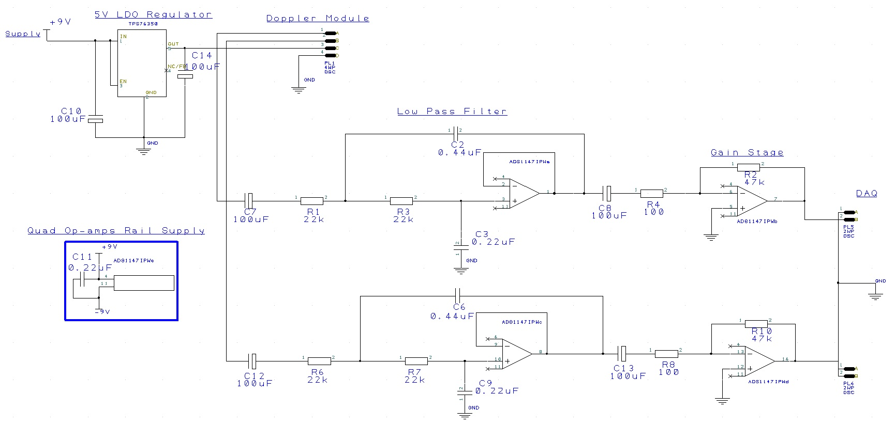
<figcaption><p>Fig A1 Prototype PCB circuit schematic</p></figcaption>
</figure>

<figure>
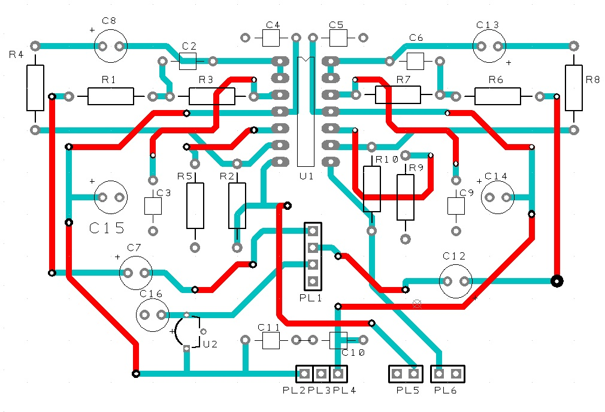
<figcaption><p>Fig A2 Prototype PCB layout</p></figcaption>
</figure>

<figure>
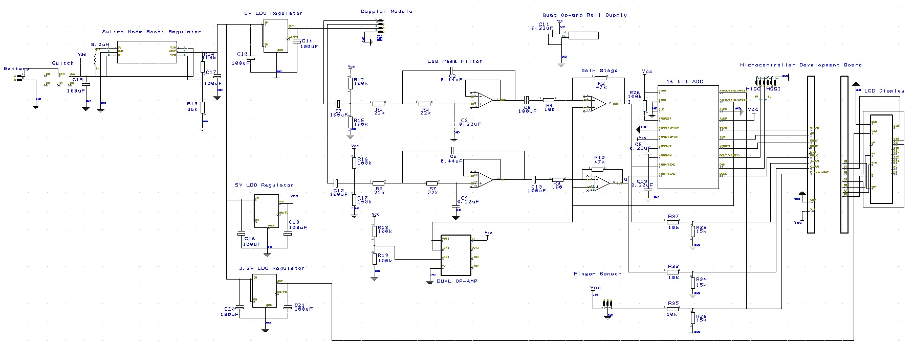
<figcaption><p>Fig A3 Final PCB circuit schematic</p></figcaption>
</figure>

<figure>
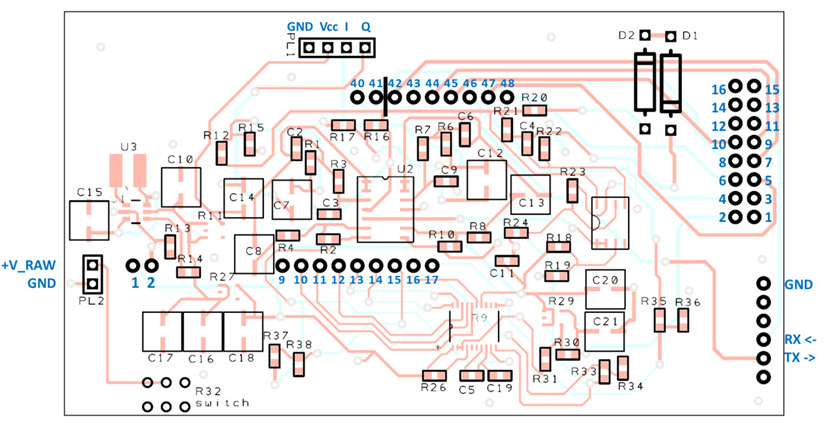
<figcaption><p><strong>Display connector</strong></p></figcaption>
</figure>

|                        |                                |                     |
|:----------------------:|--------------------------------|---------------------|
| **Pin (on LPC board)** | **Board connection**           | **LPC port**        |
|           1            | GND (ground)                   |                     |
|           2            | Vcc (5V, not 3.3V)             |                     |
|                        |                                |                     |
|           9            | To ADC, pin 15 (START)         | P0.0 ADC_START      |
|           10           | to ADC, pin 18 (DRDY)          | P0.1 ADC_DRDY       |
|           11           | To ADC, pin 19 (DIN)           | P0.18 ADC_DI (MOSI) |
|           12           | To ADC, pin 18 (DOUT)          | P0.17 ADC_DO (MISO) |
|           13           | To ADC, pin 20 (SCLK)          | P0.15 ADC_SCK       |
|           14           | To ADC, pin 16 (CS)            | P0.16 ADC_CS        |
|           15           | Channel I                      | ADC0                |
|           16           | Channel Q                      | ADC1                |
|           17           | Finger sensor                  | ADC2                |
| **Pin (on LPC board)** | **Board connection**           | **LPC port**        |
|           40           | TX (MISO) (RS232)              | P0.10               |
|           41           | RX (MOSI) (RS232)              | P0.11               |
|                        | **Display connector (16 pin)** |                     |
|           42           | pin 11 (D4)                    | P2.0                |
|           43           | pin 12 (D5)                    | P2.1                |
|           44           | pin 13 (D6)                    | P2.2                |
|           45           | pin 14 (D7)                    | P2.3                |
|           46           | pin 4 (RS)                     | P2.4                |
|           47           | pin 5 (R/W)                    | P2.5                |
|           48           | pin 6 (E)                      | P2.6                |

Fig A4 Final PCB layout

Table A1 Final PCB pin-out guide

<figure>
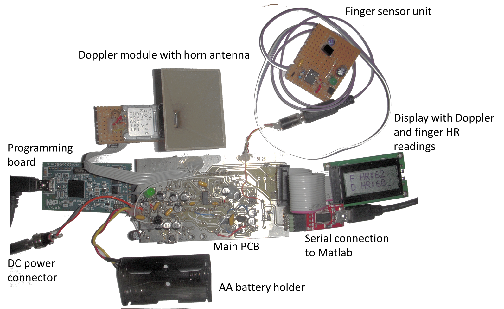
<figcaption><p>Fig A5 Operating prototype</p></figcaption>
</figure>

# Appendix B

<figure>
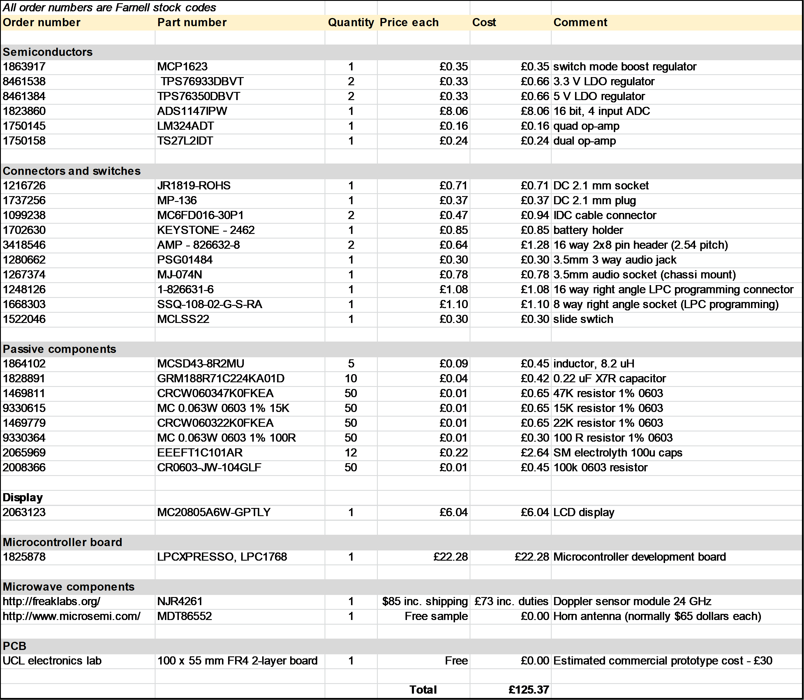
<figcaption><p>Table B1 BOM used in final PCB</p></figcaption>
</figure>

| **PCB** |
|----|
| **Mistakes:** |
| Holes diameter is too small for all the IDC connectors |
| LCD: the 4 data bits (P2.\[0..3\]) should be connected to 4 MSB (D7..D4) and not the LSB of the LCD data butts. |
| ADS references should be connected: REF0N to ground and REF0P to op-amp Vcc/2. |
| 3.3 V regulator for the microcontroller should be powered directly from a switching converter, to minimise common-mode power tracks with sensitive circuitry. |
| SPI interface to ADS is connected wrong. |
| **Improvements:** |
| Ground thermals are too thick and make soldering problematic. |
| Larger footprint for capacitors and SOT23-5 footprints for ease of soldering. |
| Add ceramic decoupling capacitors at each IC. |
| Add power indicator LED. |
| Use common-cathode Schottky diode or dedicated chip to manage power from DC power supply. |
| Add ferrite bead/inductor after switching converted to minimise ripple noise. |
| Add transistor enable switches for both LCD backlight and IR LED, controlled by the μC. |

Figure B2 Known mistakes and suggested improvements for final PCB
